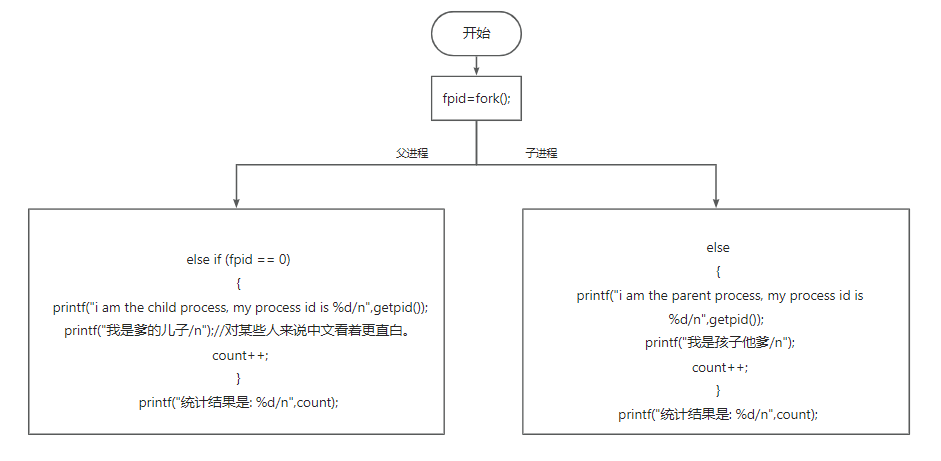

# fork函数

```c
#include <unistd.h>
#include <stdio.h> 
int main () 
{ 
	pid_t fpid; //fpid表示fork函数返回的值
	int count=0;
	fpid=fork(); 
	if (fpid < 0) 
		printf("error in fork!"); 
	else if (fpid == 0) 
	{
		printf("i am the child process, my process id is %d/n",getpid()); 
		printf("我是爹的儿子/n");//对某些人来说中文看着更直白。
		count++;
	}
	else 
	{
		printf("i am the parent process, my process id is %d/n",getpid()); 
		printf("我是孩子他爹/n");
		count++;
	}
	printf("统计结果是: %d/n",count);
	return 0;
}
```
```c
输出结果
i am the child process, my process id is 5574
我是爹的儿子
统计结果是: 1
i am the parent process, my process id is 5573
我是孩子他爹
统计结果是: 1
```
这个地方有一个特点，就是打印了两次，但是count还是1
在fpid=fork(); 之后进程被新创建一个，一个进程执行fpid==0,一个进程执行else,而且虽然count此时是两个进程单独的变量，所以计数是独立的
为什么两个进程的fpid不同呢，这与fork函数的特性有关。fork调用的一个奇妙之处就是它仅仅被调用一次，却能够返回两次，它可能有三种不同的返回值：
1. 在父进程中，fork返回新创建子进程的进程ID；
2. 在子进程中，fork返回0；
3. 如果出现错误，fork返回一个负值；


执行完fork后，进程1的变量为count=0，fpid！=0（父进程）。进程2的变量为count=0，fpid=0（子进程），这两个进程的变量都是独立的，存在不同的地址中，不是共用的，这点要注意。可以说，我们就是通过fpid来识别和操作父子进程的。
　　还有人可能疑惑为什么不是从#include处开始复制代码的，这是因为fork是把进程当前的情况拷贝一份，执行fork时，进程已经执行完了int count=0;fork只拷贝下一个要执行的代码到新的进程。
>参考资料https://blog.csdn.net/Sunnyside_/article/details/108196543?spm=1001.2101.3001.6650.1&utm_medium=distribute.pc_relevant.none-task-blog-2%7Edefault%7ECTRLIST%7ERate-1-108196543-blog-109169941.235%5Ev38%5Epc_relevant_sort_base1&depth_1-utm_source=distribute.pc_relevant.none-task-blog-2%7Edefault%7ECTRLIST%7ERate-1-108196543-blog-109169941.235%5Ev38%5Epc_relevant_sort_base1&utm_relevant_index=2
   


