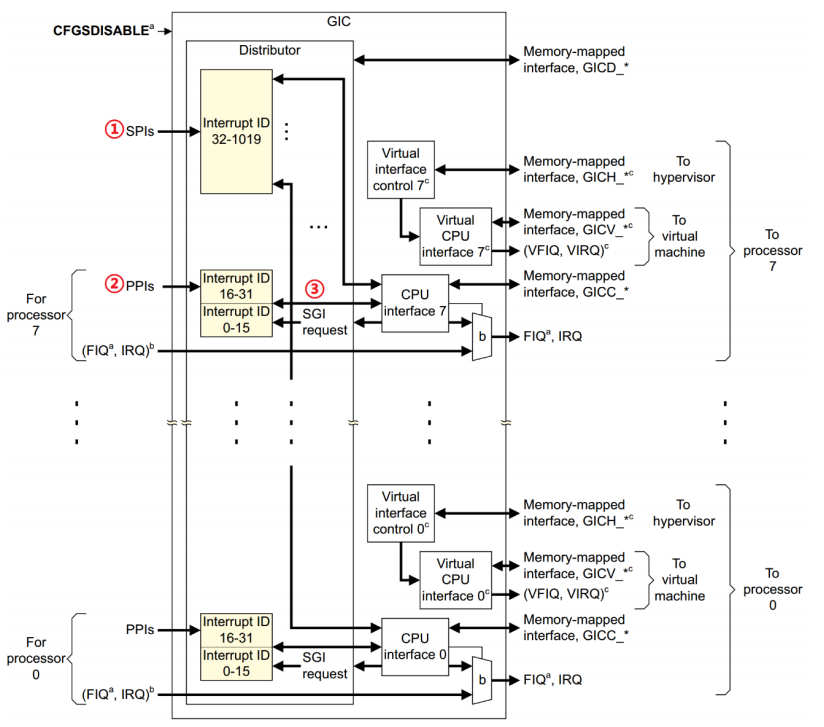
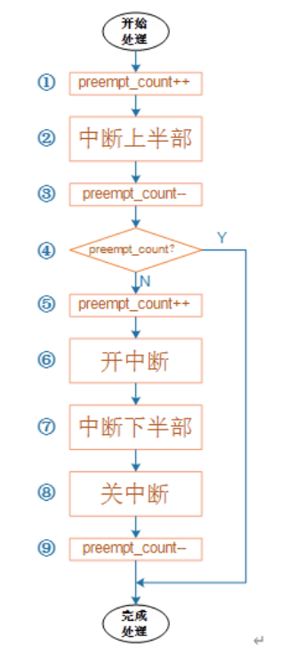

# linux中断

1. 复位中断，CPU 复位以后就会进入复位中断，我们可以在复位中断服务函数里面做一些初始化工作，比如初始化 SP 指针、DDR 等等。
2. 未定义指令中断(Undefined Instruction)，如果指令不能识别的话就会产生此中断
3. 软中断(Software Interrupt,SWI)，由 SWI 指令引起的中断，Linux 的系统调用会用 SWI指令来引起软中断，通过软中断来陷入到内核空间。
4. 指令预取中止中断(Prefetch Abort)，预取指令的出错的时候会产生此中断。
5. 数据访问中止中断(Data Abort)，访问数据出错的时候会产生此中断。
6. IRQ 中断(IRQ Interrupt)，外部中断，前面已经说了，芯片内部的外设中断都会引起此
中断的发生。
7. FIQ 中断(FIQ Interrupt)，快速中断，如果需要快速处理中断的话就可以使用此中断


## GIC控制器（硬件相关）

1. SPI(Shared Peripheral Interrupt),共享中断，顾名思义，所有 Core 共享的中断，这个是最
常见的，那些外部中断都属于 SPI 中断(注意！不是 SPI 总线那个中断) 。比如按键中断、串口
中断等等，这些中断所有的 Core 都可以处理，不限定特定 Core。
2. PPI(Private Peripheral Interrupt)，私有中断，我们说了 GIC 是支持多核的，每个核肯定
有自己独有的中断。这些独有的中断肯定是要指定的核心处理，因此这些中断就叫做私有中断
3. SGI(Software-generated Interrupt)，软件中断，由软件触发引起的中断，通过向寄存器
GICD_SGIR 写入数据来触发，系统会使用 SGI 中断来完成多核之间的通信。

## GIC逻辑分块
分发器端：此逻辑块负责处理各个中断事件的分发问题，也就是中断事件应该发送到哪个 CPU Interface 上去。分发器收集所有的中断源，可以控制每个中断的优先级，它总是将优先级最高的中断事件发送到 CPU 接口端。分发器端要做的主要工作如下：
1. 全局中断使能控制。
2. 控制每一个中断的使能或者关闭。
3. 设置每个中断的优先级。
4. 设置每个中断的目标处理器列表
5. 设置每个外部中断的触发模式：电平触发或边沿触发。
6. 设置每个中断属于组 0 还是组 1。

CPU接口端：CPU 接口端听名字就知道是和 CPU Core 相连接的，因此在图 17.1.3.2 中每个 CPU Core 都可以在 GIC 中找到一个与之对应的 CPU Interface。CPU 接口端就是分发器和 CPU Core 之间的桥梁
1. 使能或者关闭发送到 CPU Core 的中断请求信号
2. 应答中断
3. 通知中断处理完成
4. 设置优先级掩码，通过掩码来设置哪些中断不需要上报给 CPU Core
5. 定义抢占策略
6. 当多个中断到来的时候，选择优先级最高的中断通知给 CPU Core

# 驱动中断

```c
int request_irq(unsigned int irq, 
irq_handler_t handler, 
unsigned long flags,
 const char *name, 
void *dev)
```
flags:中断标志
| 标志                 | 描述                                                                                                                         |
| -------------------- | ---------------------------------------------------------------------------------------------------------------------------- |
| IRQF_SHARED           | 多个设备共享一个中断线，共享的所有中断都必须指定此标志，如果使用共享中断的话，request_irq函数的dev参数就是唯一区分它们的标志 |
| IRQF_ONESHOT         | 单次触发                                                                                                                     |
| IRQF_TRIGGER_NONE    | 无触发                                                                                                                       |
| IRQF_TRIGGER_RISING  | 上升沿触发                                                                                                                   |
| IRQF_TRIGGER_FALLING | 下降沿触发                                                                                                                   |
| IRQF_TRIGGER_HIGH    | 高电平触发                                                                                                                   |
| IRQF_TRIGGER_LOW     | 低电平触发                                                                                                                   |


name：中断名字，设置以后可以在/proc/interrupts 文件中看到对应的中断名字。
dev：如果将 flags 设置为 IRQF_SHARED 的话，dev 用来区分不同的中断，一般情况下将
dev 设置为设备结构体，dev 会传递给中断处理函数 irq_handler_t 的第二个参数。
`rqreturn_t (*irq_handler_t) (int, void *)`
第一个参数是要中断处理函数要相应的中断号。第二个参数是一个指向 void 的指针，也就是个通用指针，需要与 request_irq 函数的 dev 参数保持一致
`return IRQ_RETVAL(IRQ_HANDLED)`

某个中断的使能与禁止
`void enable_irq(unsigned int irq)`
`void disable_irq(unsigned int irq)`
函数要等到当前正在执行的中断处理函数执行完才返回，因此使用者需要保证不会产生新的中断，并且确保所有已经开始执行的中断处理程序已经全部退出
`void disable_irq_nosync(unsigned int irq)`

全局中断的使能与禁止
`local_irq_enable()`
`local_irq_disable()`

假如 A 任务调用 local_irq_disable 关闭全局中断 10S，当关闭了 2S 的时候 B 任务开始运
行，B 任务也调用 local_irq_disable 关闭全局中断 3S，3 秒以后 B 任务调用 local_irq_enable 函
数将全局中断打开了。此时才过去 2+3=5 秒的时间，然后全局中断就被打开了，此时 A 任务要
关闭 10S 全局中断的愿望就破灭了，然后 A 任务就“生气了”，结果很严重，可能系统都要被
A 任务整崩溃。为了解决这个问题，B 任务不能直接简单粗暴的通过 local_irq_enable 函数来打
开全局中断，而是将中断状态恢复到以前的状态，要考虑到别的任务的感受，此时就要用到下
面两个函数：

```c
local_irq_save(flags)
local_irq_restore(flags)
其中的flag就是中断状态
```

# 上半部和下半部
## 关于中断嵌套

可以看到，发生2次硬件中断A时，它的上半部代码执行了2次，但是下半部代码只执行了一次。
1. 假如中断下半部是打印进中断的序号， 如果中断A来了执行到（6）开中断后，A再次过来那么就会到（1），再到第（4）步时，继续执行中断下半部，**那么就会打印第一次的序号，而不是第二次，也不是两次都打印**。
2. 假如中断下半部是打印进中断的序号， 如果中断A来了执行到（6）开中断后，B中断过来那么就会到（1），再到第（4）步时，继续执行中断下半部，**那么就会打印就会打印A  和B中断的序号**。
3. **中断上半部、下半部的执行过程中，不能休眠：中断休眠的话，以后谁来调度进程啊**
## 软中断
如果对内核源码有一定了解就会发现，softirq 用到的地方非常少，原因之一就是上面提到的，**它是静态编译的， 靠内置的 ksoftirqd 线程来调度内置的那 9 种 softirq。如果想新加一种，就得修改并重新编译内核， 所以开发成本非常高。**
```c
/* PLEASE, avoid to allocate new softirqs, if you need not _really_ high
   frequency threaded job scheduling. For almost all the purposes
   tasklets are more than enough. F.e. all serial device BHs et
   al. should be converted to tasklets, not to softirqs.
 */
enum
{
    HI_SOFTIRQ=0,
    TIMER_SOFTIRQ,
    NET_TX_SOFTIRQ,
    NET_RX_SOFTIRQ,
    BLOCK_SOFTIRQ,
    IRQ_POLL_SOFTIRQ,
    TASKLET_SOFTIRQ,
    SCHED_SOFTIRQ,
    HRTIMER_SOFTIRQ, /* Unused, but kept as tools rely on the
                numbering. Sigh! */
    RCU_SOFTIRQ,    /* Preferable RCU should always be the last softirq */

    NR_SOFTIRQS
};

nr 是enum 结构中定义的枚举值
action 是一个函数指针
void open_softirq(int nr, void (*action)(struct softirq_action *))
{
    softirq_vec[nr].action = action;
}
void raise_softirq(unsigned int nr);
```
因为 softirq 是可以被硬中断抢占执行的，可能存在这种情况：在执行 softirq 时，被硬件中断抢占执行，在硬件中断退出时在 irq_exit() 函数中会不会重复执行 softirq？ **答案是不会，当原本就处于 softirq 执行环境下时，不会重新进入软中断执行，而是在中断返回的时候返回到上次软中断被打断的现场继续执行软中断。**
```c
enum
{
    HI_SOFTIRQ=0,
    TIMER_SOFTIRQ,
    NET_TX_SOFTIRQ,
    NET_RX_SOFTIRQ,
    BLOCK_SOFTIRQ,
    IRQ_POLL_SOFTIRQ,
    TASKLET_SOFTIRQ,
    SCHED_SOFTIRQ,
    HRTIMER_SOFTIRQ, 
    RCU_SOFTIRQ,    

    TEST_SOFTIRQ,    //新添加的 softirq

    NR_SOFTIRQS
};
导出函数
EXPORT_SYMBOL(open_softirq);  //添加到 open_softirq 函数实现下
EXPORT_SYMBOL(raise_softirq); //添加到 raise_softirq 函数实现下
编译内核
```
```c
#include <linux/init.h>
#include <linux/module.h>
#include <linux/kernel.h>
#include <linux/interrupt.h>

MODULE_LICENSE("GPL");

static void test_softirq_action(struct softirq_action *a)
{
        printk("Test softirq excuted!\n");
}

static int __init msoftirq_init(void)
{
        //注册 softirq
        open_softirq(TEST_SOFTIRQ, test_softirq_action);
        //触发 softirq
        raise_softirq(TEST_SOFTIRQ);

        return 0;
}

static void __exit msoftirq_exit(void)
{
}

module_init(msoftirq_init);
module_exit(msoftirq_exit);
编译并加载该 softirq 代码，使用 dmesg | tail 指令就可以看到 softirq 输出的log：
Test softirq excuted!
```
**本质上就是一个函数指针数组，每个指针指向一个回调函数，在硬件中断退出时执行回调函数**
## tasklet
```c
#include <linux/kernel.h>
#include <linux/module.h>
#include <linux/interrupt.h>
#include <linux/irq.h>
#include <linux/delay.h>
#include <linux/time.h>
#include <linux/input.h>
#include <linux/init.h>
#include <linux/gpio.h>

#include <asm/io.h>
#include <asm/irq.h>


#define IMX_GPIO_NR(bank, nr)               (((bank) - 1) * 32 + (nr)) //平台相关
#define CYNO_GPIO_BEEP_NUM                  IMX_GPIO_NR(6,10) //本程序使用的gpio口

//定义gpio引脚的结构体
static struct pin_desc{
    int irq;
    unsigned char *name;
    unsigned int pin;
};

//实例化一个具体的引脚
static struct pin_desc beep_desc = {
    0,
    "beep_num",
    CYNO_GPIO_BEEP_NUM
};

//生命tasklet触发函数，也就是中断下半部函数
void beep_tasklet_func(unsigned long data);

//生命一个tasklet，名字为beep_tasklet，并且关联触发函数
DECLARE_TASKLET(beep_tasklet, beep_tasklet_func, 0);

int flag = 0;

//中断下半部函数实现
void beep_tasklet_func(unsigned long data){

    flag++;

    printk(KERN_INFO "-------\n");

    if(flag >= 60){
        printk(KERN_INFO "%s : flag = %d\n", __func__, flag);
        flag = 0;
    }
}


/*
无论什么时候调用tasklet_schedule
一定是上半部代码执行结束，再执行下半部代码
*/
static irqreturn_t beep_interrupt_handler(int irq, void *dev_id)
{
    printk(KERN_INFO "%s : top tasklet func\n", __func__);
    tasklet_schedule(&beep_tasklet);    //触发下半部代码
    printk(KERN_INFO "%s : bottom tasklet func\n", __func__);
    return IRQ_HANDLED;
}

//模块加载执行
static int interrupt_tasklet_init(void)
{
    int ret;

    printk(KERN_INFO "%s\n", __func__);
    //申请gpio
    if(gpio_request(beep_desc.pin ,beep_desc.name)){
        printk(KERN_ERR "%s : request gpio %d error\n", __func__, beep_desc.pin);
        goto err_gpio_request;
    }
    //设置gpio方向为输入
    gpio_direction_input(beep_desc.pin);
    //动态获取irq端口号
    beep_desc.irq = gpio_to_irq(beep_desc.pin);
    printk(KERN_INFO "%s : the irq num is %d\n", __func__, beep_desc.irq);
    //申请中断，并设置触发方式为下降沿，设置中断处理函数（上半部）    
    ret = request_irq(beep_desc.irq, beep_interrupt_handler , IRQF_TRIGGER_FALLING , beep_desc.name , &beep_desc);
    if(ret){
        printk(KERN_ERR "%s : request_irq is error\n", __func__);
        goto err_request_irq;
    }

    printk("%s : init end\n", __func__);

    return 0;

//处理错误
err_request_irq:
    free_irq(beep_desc.irq, &beep_desc);

err_gpio_request:
    gpio_free(beep_desc.pin);
    return -1;
}

//驱动卸载执行
static void interrupt_tasklet_exit(void)
{
    printk("%s\n", __func__);
    free_irq(beep_desc.irq, &beep_desc);
    gpio_free(beep_desc.pin);
}

module_init(interrupt_tasklet_init);
module_exit(interrupt_tasklet_exit);

MODULE_AUTHOR("123");
MODULE_DESCRIPTION("interrupt tasklet use");
MODULE_LICENSE("GPL");
一个tasklet使用的例子
简单分析流程
1. void beep_tasklet_func(unsigned long data)；//创建回调函数
2. DECLARE_TASKLET(beep_tasklet, beep_tasklet_func, 0);//创建tasklet
3. static irqreturn_t beep_interrupt_handler(int irq, void *dev_id)
    {
        tasklet_schedule(&beep_tasklet);    //触发下半部代码
        return IRQ_HANDLED;
    }//创建中断处理函数，触发下半部
4. ret = request_irq(beep_desc.irq, beep_interrupt_handler , IRQF_TRIGGER_FALLING , beep_desc.name , &beep_desc);//注册中断函数
5. free_irq();

```
## 工作队列
```c
#include <linux/module.h>
#include <linux/kernel.h>
#include <linux/init.h>
#include <linux/platform_device.h>
#include <linux/fb.h>
#include <linux/backlight.h>
#include <linux/err.h>
#include <linux/pwm.h>
#include <linux/slab.h>
#include <linux/miscdevice.h>
#include <linux/delay.h>
#include <linux/gpio.h>
#include <mach/gpio.h>
#include <plat/gpio-cfg.h>
#include <linux/timer.h>  /*timer*/
#include <asm/uaccess.h>  /*jiffies*/
#include <linux/delay.h>
#include <linux/interrupt.h>
#include <linux/workqueue.h>
struct tasklet_struct task_t ;
struct workqueue_struct *mywork ;
//定义一个工作队列结构体
struct work_struct work;
static void task_fuc(unsigned long data)
{
   if(in_interrupt()){
            printk("%s in interrupt handle!\n",__FUNCTION__);
       }
}
//工作队列处理函数
static void mywork_fuc(struct work_struct *work)
{
   if(in_interrupt()){
            printk("%s in interrupt handle!\n",__FUNCTION__);
       }
   msleep(2);
   printk("%s in process handle!\n",__FUNCTION__);
}

static irqreturn_t irq_fuction(int irq, void *dev_id)
{
   tasklet_schedule(&task_t);
   //调度工作
   schedule_work(&work);
   if(in_interrupt()){
        printk("%s in interrupt handle!\n",__FUNCTION__);
   }
   printk("key_irq:%d\n",irq);
   return IRQ_HANDLED ;
}

static int __init tiny4412_Key_irq_test_init(void)
{
   int err = 0 ;
   int irq_num1 ;
   int data_t = 100 ;
   //创建新队列和新工作者线程
   mywork = create_workqueue("my work");
   //初始化
   INIT_WORK(&work,mywork_fuc);
   //调度指定队列
   queue_work(mywork,&work);
   tasklet_init(&task_t,task_fuc,data_t);
   printk("irq_key init\n");
   irq_num1 = gpio_to_irq(EXYNOS4_GPX3(2));
   err = request_irq(irq_num1,irq_fuction,IRQF_TRIGGER_FALLING,"tiny4412_key1",(void *)"key1");
   if(err != 0){
       free_irq(irq_num1,(void *)"key1");
       return -1 ;
   }
   return 0 ;
}

static void __exit tiny4412_Key_irq_test_exit(void)
{
   int irq_num1 ;
   printk("irq_key exit\n");
   irq_num1 = gpio_to_irq(EXYNOS4_GPX3(2));
   //销毁一条工作队列
   destroy_workqueue(mywork);
   free_irq(irq_num1,(void *)"key1");
}

module_init(tiny4412_Key_irq_test_init);
module_exit(tiny4412_Key_irq_test_exit);

MODULE_LICENSE("GPL");
MODULE_AUTHOR("YYX");
MODULE_DESCRIPTION("Exynos4 KEY Driver");
//简化流程
1. struct workqueue_struct *mywork ;//定义变量
2. mywork = create_workqueue("my work");//创建工作队列
3. INIT_WORK(&work,mywork_fuc);//初始化工作队列
4. queue_work(mywork,&work);//调度指定队列
5. mywork_fuc();//创建队列执行函数
6. irq_fuction();//创建中断回调函数
{
    //调度工作
   schedule_work(&work);
}
7. request_irq(irq_num1,irq_fuction,IRQF_TRIGGER_FALLING,"tiny4412_key1",(void *)"key1");//注册中断函数
工作在线程模式，本质上就是一个高优先级的线程
```
## 中断共享
多个设备共享一根中断线
1. 共享中断的多个设备在申请中断时，都应该使用IRQF_SHARED标志。
2. dev_id设备指针做为传入参数最佳
3. 在中断到来时，会遍历执行共享中断，直到某个函数返回IRQ_HANDLED,在中断处理函数顶半部根据硬件寄存器信息对比传入的dev_id是否为本设备中断，若不是应迅速返回IRQ_NONE
可以类比STM32的共享中断
```c
void EXTI9_5_IRQHandler(void)
{
    if(EXTI_GetITStatus(EXTI_Line5) != RESET)
    {
    }
    else if (EXTI_GetITStatus(EXTI_Line6) != RESET)
    {
    }
    else if (EXTI_GetITStatus(EXTI_Line7) != RESET)
    {
    }
    EXTI_ClearITPendingBit(EXTI_Line5);
    EXTI_ClearITPendingBit(EXTI_Line6);
    EXTI_ClearITPendingBit(EXTI_Line7);
}
```
```c
简化流程
irqreturn_t _interrupt(int irq,void *dev_id)
{
...
int status = read_int_status();
if(!is_myint(dev_id,status))
{
return IRQ_NONE;
}
return IRQ_HANDLED;
}

request_irq(sh_irq,_interrupt,IRQ_SHARED,"xxx",xx_dev);

free_irq(xx_irq,_interrupt);


```
参考链接:
>https://blog.csdn.net/zoe512622789/article/details/53544287
>https://zhuanlan.zhihu.com/p/528866826


