# linux物理内存
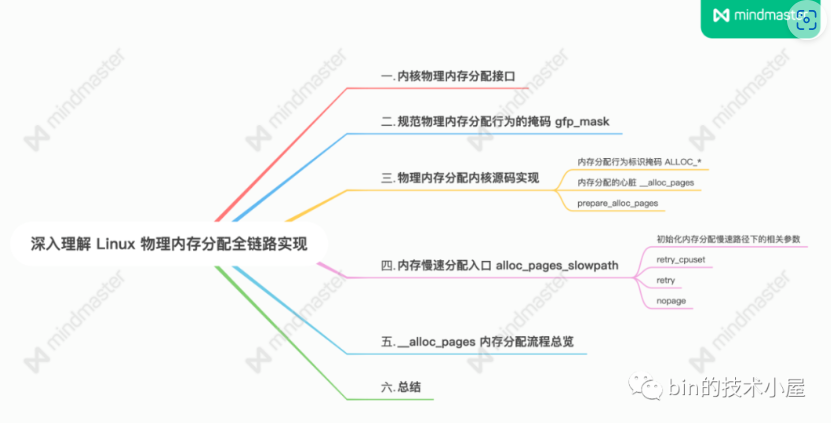
## 从CPU角度看物理内存模型
物理内存划分为一页一页的内存块，每页大小为 4K。一页大小的内存块在内核中用 struct page 结构体来进行管理，struct page 中封装了每页内存块的状态信息，比如：组织结构，使用信息，统计信息，以及与其他结构的关联映射信息等
内核提供了两个宏来完成 PFN 与 物理页结构体 struct page 之间的相互转换。它们分别是 page_to_pfn 与 pfn_to_page

### FLATMEM 平坦内存模型
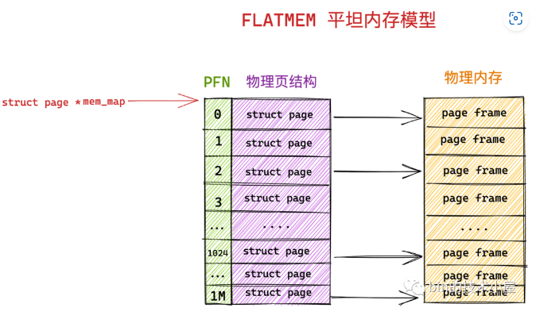
在平坦内存模型下 ，page_to_pfn 与 pfn_to_page 的计算逻辑就非常简单，本质就是基于 mem_map 数组进行偏移操作
```c
#if defined(CONFIG_FLATMEM)
#define __pfn_to_page(pfn) (mem_map + ((pfn)-ARCH_PFN_OFFSET))
#define __page_to_pfn(page) ((unsigned long)((page)-mem_map) + ARCH_PFN_OFFSET)
#endif
```
>内核中的默认配置是使用 FLATMEM 平坦内存模型。
### DISCONTIGMEM 非连续内存模型
由于用于组织物理页的底层数据结构是 mem_map 数组，数组的特性又要求这些物理页是连续的，所以只能为这些内存地址空洞也分配 struct page 结构用来填充数组使其连续。
而每个 struct page 结构大部分情况下需要占用 40 字节，如果物理内存中存在的大块的地址空洞，那么为这些空洞而分配的 struct page 将会占用大量的内存空间，导致巨大的浪费。
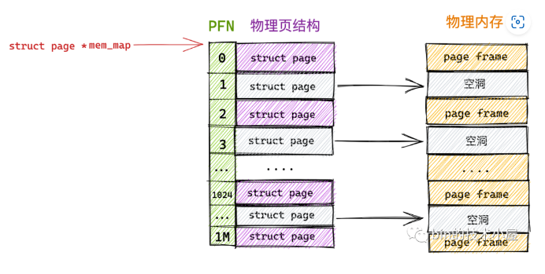
在 DISCONTIGMEM 非连续内存模型中，内核将物理内存从宏观上划分成了一个一个的节点 node （微观上还是一页一页的物理页），每个 node 节点管理一块连续的物理内存。这样一来这些连续的物理内存页均被划归到了对应的 node 节点中管理，就避免了内存空洞造成的空间浪费。
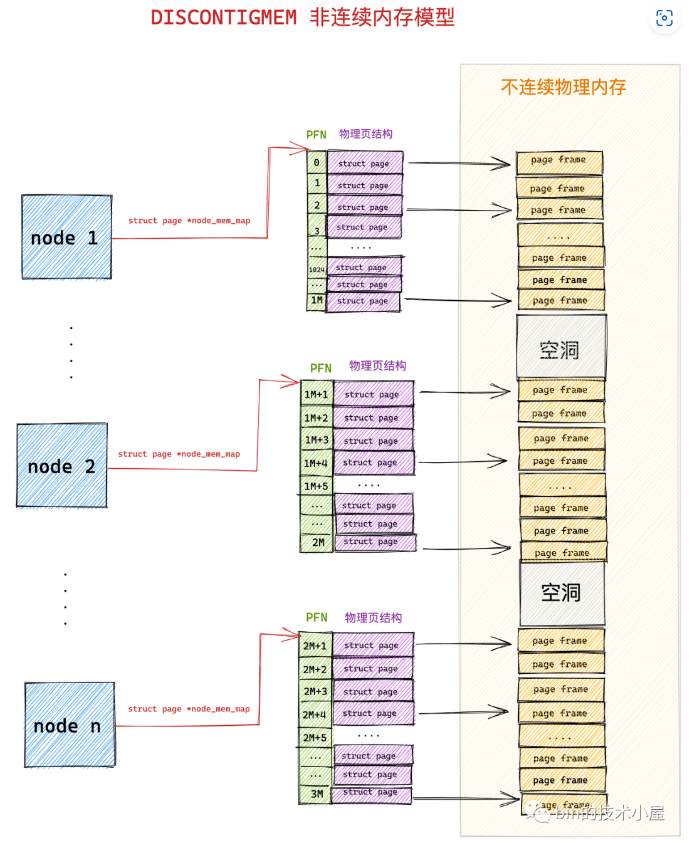

内核中使用 struct pglist_data 表示用于管理连续物理内存的 node 节点（内核假设 node 中的物理内存是连续的），既然每个 node 节点中的物理内存是连续的，于是在每个 node 节点中还是采用 FLATMEM 平坦内存模型的方式来组织管理物理内存页。每个 node 节点中包含一个  struct page *node_mem_map 数组，用来组织管理 node 中的连续物理内存页。
```c
typedef struct pglist_data {
   #ifdef CONFIG_FLATMEM
   struct page *node_mem_map;
   #endif
}
```
由于引入了 node 节点这个概念，所以在 DISCONTIGMEM 非连续内存模型下 page_to_pfn 与 pfn_to_page 的计算逻辑就比 FLATMEM 内存模型下的计算逻辑多了一步定位 page 所在 node 的操作。

1. 通过 arch_pfn_to_nid 可以根据物理页的 PFN 定位到物理页所在 node。

2. 通过 page_to_nid 可以根据物理页结构 struct page 定义到 page 所在 node。
```c
#if defined(CONFIG_DISCONTIGMEM)

#define __pfn_to_page(pfn)   \
({ unsigned long __pfn = (pfn);  \
 unsigned long __nid = arch_pfn_to_nid(__pfn);  \
 NODE_DATA(__nid)->node_mem_map + arch_local_page_offset(__pfn, __nid);\
})

#define __page_to_pfn(pg)      \
({ const struct page *__pg = (pg);     \
 struct pglist_data *__pgdat = NODE_DATA(page_to_nid(__pg)); \
 (unsigned long)(__pg - __pgdat->node_mem_map) +   \
  __pgdat->node_start_pfn;     \
})
```
### SPARSEMEM 稀疏内存模型
随着内存技术的发展，内核可以支持物理内存的热插拔了，这样一来物理内存的不连续就变为常态了，在上小节介绍的 DISCONTIGMEM 内存模型中，其实每个 node 中的物理内存也不一定都是连续的。
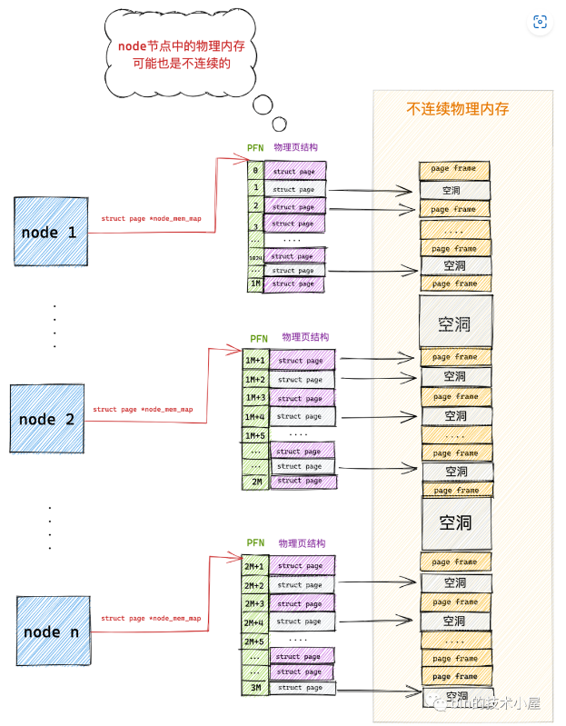
SPARSEMEM 稀疏内存模型的核心思想就是对粒度更小的连续内存块进行精细的管理，用于管理连续内存块的单元被称作 section 。物理页大小为 4k 的情况下， section 的大小为 128M 
在内核中用 struct mem_section 结构体表示 SPARSEMEM 模型中的 section。
```c
struct mem_section {
 unsigned long section_mem_map;
        ...
}
```
由于 section 被用作管理小粒度的连续内存块，这些小的连续物理内存在 section 中也是通过数组的方式被组织管理，每个 struct mem_section 结构体中有一个 section_mem_map 指针用于指向 section 中管理连续内存的 page 数组。
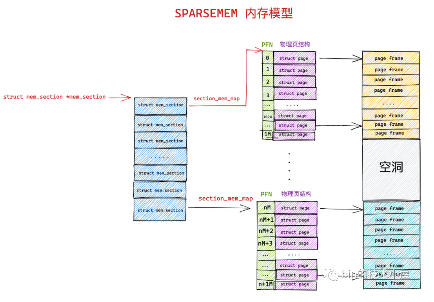


## 从 CPU 角度看物理内存架构
### 一致性内存访问 UMA 架构
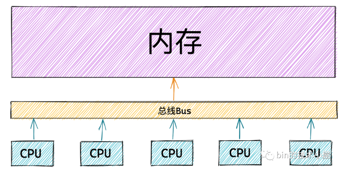
UMA 架构的优点很明显就是结构简单，所有的 CPU 访问内存速度都是一致的，都必须经过总线。然而它的缺点笔者刚刚也提到了，就是随着处理器核数的增多，总线的带宽压力会越来越大。解决办法就只能扩宽总线，然而成本十分高昂，未来可能仍然面临带宽压力。

为了解决以上问题，提高 CPU 访问内存的性能和扩展性，于是引入了一种新的架构：非一致性内存访问 NUMA（Non-uniform memory access）。
### 非一致性内存访问 NUMA 架构
在 NUMA 架构下，任意一个 CPU 都可以访问全部的内存节点，访问自己的本地内存节点是最快的，但访问其他内存节点就会慢很多，这就导致了 CPU 访问内存的速度不一致，所以叫做非一致性内存访问架构。
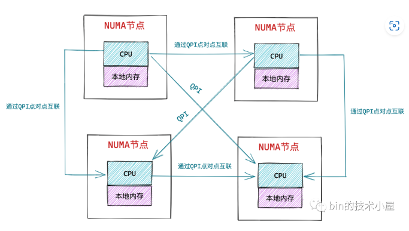
>在 NUMA 架构下，只有 DISCONTIGMEM 非连续内存模型和 SPARSEMEM 稀疏内存模型是可用的。而 UMA 架构下，前面介绍的三种内存模型都可以配置使用。

#### NUMA 的内存分配策略
NUMA 的内存分配策略是指在 NUMA 架构下 CPU 如何请求内存分配的相关策略，比如：是优先请求本地内存节点分配内存呢 ？还是优先请求指定的 NUMA 节点分配内存 ？是只能在本地内存节点分配呢 ？还是允许当本地内存不足的情况下可以请求远程 NUMA 节点分配内存 ？
```c
#include <numaif.h>
long set_mempolicy(int mode, const unsigned long *nodemask,unsigned long maxnode);
```
## 内核如何管理NUMA
内核使用了一个大小为 MAX_NUMNODES ，类型为 struct pglist_data 的全局数组 node_data[] 来管理所有的 NUMA 节点。
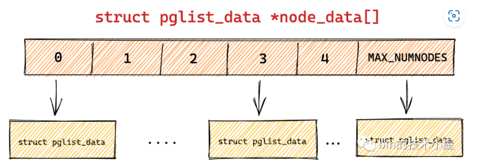
全局数组 node_data[] 定义在文件 `/arch/arm64/include/asm/mmzone.h`中：
```c
#ifdef CONFIG_NUMA
extern struct pglist_data *node_data[];
#define NODE_DATA(nid)  (node_data[(nid)])
```
>NODE_DATA(nid) 宏可以通过 NUMA 节点的 nodeId，找到对应的 struct pglist_data 结构。
```c
#ifdef CONFIG_NODES_SHIFT
#define NODES_SHIFT     CONFIG_NODES_SHIFT
#else
#define NODES_SHIFT     0
#endif
#define MAX_NUMNODES    (1 << NODES_SHIFT)
```

### 节点描述符pglist_data 结构
```c
typedef struct pglist_data {
    // NUMA 节点id
    int node_id;
    // 指向 NUMA 节点内管理所有物理页 page 的数组
    struct page *node_mem_map;
    // NUMA 节点内第一个物理页的 pfn
    unsigned long node_start_pfn;
    // NUMA 节点内所有可用的物理页个数（不包含内存空洞）
    unsigned long node_present_pages;
    // NUMA 节点内所有的物理页个数（包含内存空洞）
    unsigned long node_spanned_pages; 
    // 保证多进程可以并发安全的访问 NUMA 节点
    spinlock_t node_size_lock;
        .............
}
```
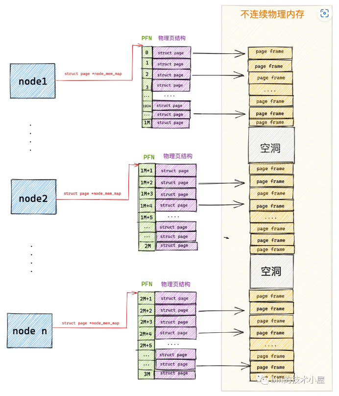

node_start_pfn 指向 NUMA 节点内第一个物理页的 PFN，系统中所有 NUMA 节点中的物理页都是依次编号的，每个物理页的 PFN 都是全局唯一的（不只是其所在 NUMA 节点内唯一）
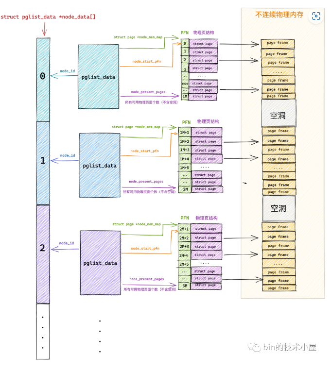

### NUMA节点物理内存区域的划分

1. ZONE_DEVICE 是为支持热插拔设备而分配的非易失性内存（ Non Volatile Memory ），也可用于内核崩溃时保存相关的调试信息。
2. ZONE_MOVABLE 是内核定义的一个虚拟内存区域，该区域中的物理页可以来自于上边介绍的几种真实的物理区域。该区域中的页全部都是可以迁移的，主要是为了防止内存碎片和支持内存的热插拔。

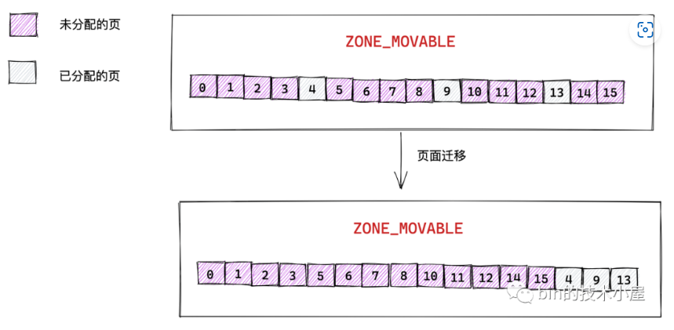
内核通过迁移页面来规整内存，这样就可以避免内存碎片，从而得到一大片连续的物理内存，以满足内核对大块连续内存分配的请求。所以这就是内核需要根据物理页面是否能够迁移的特性，而划分出 ZONE_MOVABLE 区域的目的。
```c
typedef struct pglist_data {
  // NUMA 节点中的物理内存区域个数
 int nr_zones; 
  // NUMA 节点中的物理内存区域
 struct zone node_zones[MAX_NR_ZONES];
  // NUMA 节点的备用列表
 struct zonelist node_zonelists[MAX_ZONELISTS];
} pg_data_t;
```
node_zones[MAX_NR_ZONES] 数组包含了 NUMA 节点中的所有物理内存区域，物理内存区域在内核中的数据结构是 struct zone 
node_zonelists[MAX_ZONELISTS] 是 struct zonelist 类型的数组，它包含了备用 NUMA 节点和这些备用节点中的物理内存区域
不是每个 NUMA 节点都会包含以上介绍的所有物理内存区域，NUMA 节点之间所包含的物理内存区域个数是不一样的。
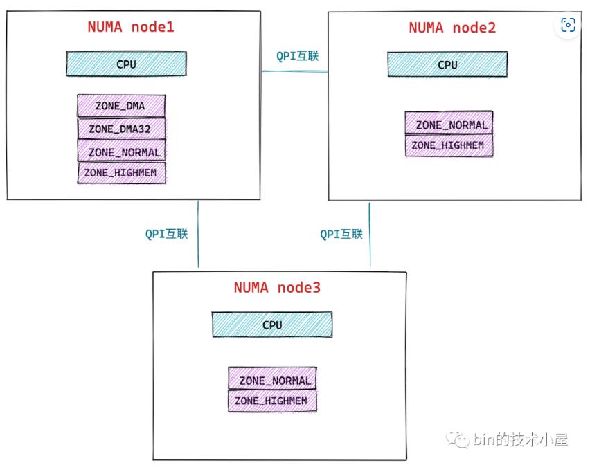
### NUMA节点中的内存规整与回收

## 内核如何管理 NUMA 节点中的物理内存区域

```c
struct zone {
    // 防止并发访问该内存区域
    spinlock_t      lock;
    // 内存区域名称：Normal ，DMA，HighMem
    const char      *name;
    // 指向该内存区域所属的 NUMA 节点
    struct pglist_data  *zone_pgdat;
    // 属于该内存区域中的第一个物理页 PFN
    unsigned long       zone_start_pfn;
    // 该内存区域中所有的物理页个数（包含内存空洞）
    unsigned long       spanned_pages;
    // 该内存区域所有可用的物理页个数（不包含内存空洞）
    unsigned long       present_pages;
    // 被伙伴系统所管理的物理页数
    atomic_long_t       managed_pages;
    // 伙伴系统的核心数据结构
    struct free_area    free_area[MAX_ORDER];
    // 该内存区域内存使用的统计信息
    atomic_long_t       vm_stat[NR_VM_ZONE_STAT_ITEMS];
} ____cacheline_internodealigned_in_smp;
```

```c
typedef struct pglist_data {
    // NUMA 节点中的物理内存区域个数
    int nr_zones; 
    // NUMA 节点中的物理内存区域
    struct zone node_zones[MAX_NR_ZONES];
}
```
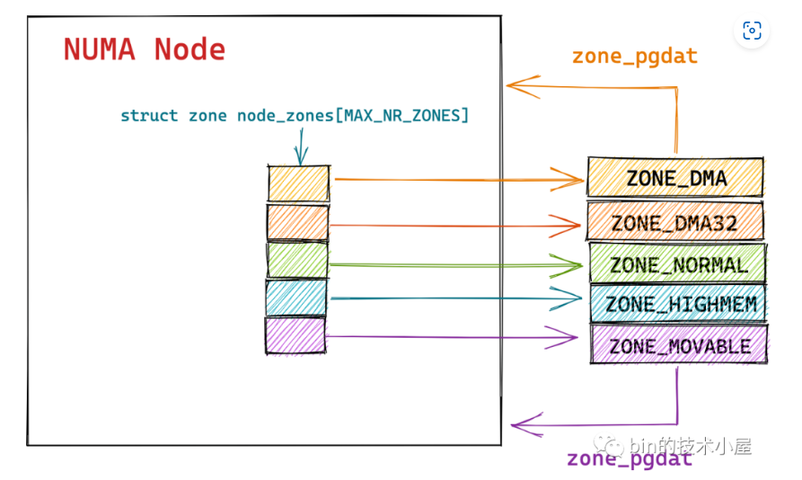

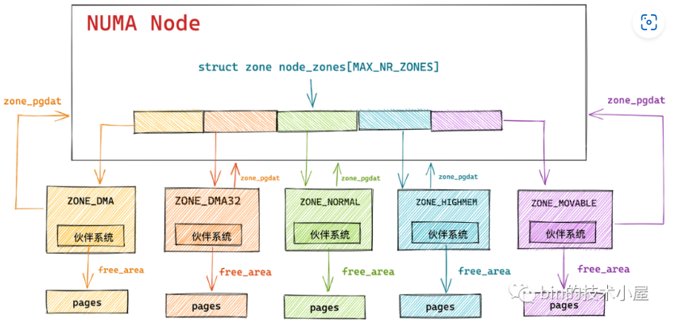

高位内存区域为什么会对低位内存区域进行挤压呢?
一些用于常规用途的物理内存则可以从多个物理内存区域中进行分配，当 ZONE_HIGHMEM 区域中的内存不足时，内核可以从 ZONE_NORMAL 进行内存分配，ZONE_NORMAL 区域内存不足时可以进一步降级到 ZONE_DMA 区域进行分配。
### 物理内存区域中的水位线

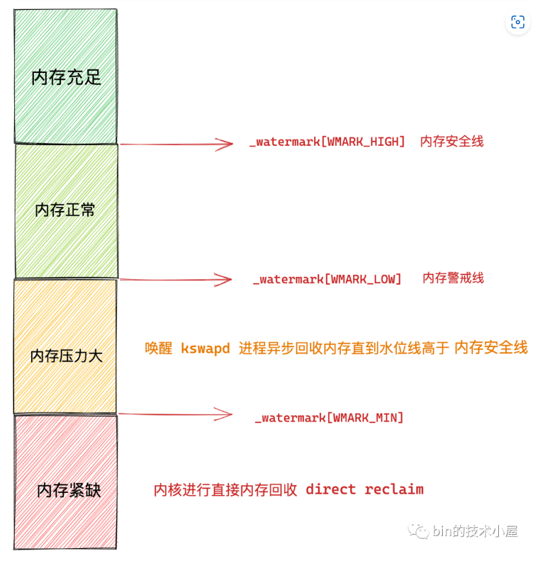
1. 当该物理内存区域的剩余内存容量高于  _watermark[WMARK_HIGH] 时，说明此时该物理内存区域中的内存容量非常充足，内存分配完全没有压力。

2. 当剩余内存容量在 _watermark[WMARK_LOW] 与_watermark[WMARK_HIGH] 之间时，说明此时内存有一定的消耗但是还可以接受，能够继续满足进程的内存分配需求。

3. 当剩余内容容量在 _watermark[WMARK_MIN] 与 _watermark[WMARK_LOW]  之间时，说明此时内存容量已经有点危险了，内存分配面临一定的压力，但是还可以满足进程的内存分配要求，当给进程分配完内存之后，就会唤醒 kswapd 进程开始内存回收，直到剩余内存高于 _watermark[WMARK_HIGH] 为止。
4. 当剩余内容容量低于 _watermark[WMARK_MIN] 时，说明此时的内容容量已经非常危险了，如果进程在这时请求内存分配，内核就会进行直接内存回收，这时请求进程会同步阻塞等待，直到内存回收完毕。

## 内核如何描述物理内存页
那么 Linux 为什么会默认采用 4KB 作为标准物理内存页的大小呢?
内存与此片之间交互频繁，4kB 和 4MB 都是磁盘块大小的整数倍，小内存复制速度更快，所以内核会采用 4KB 作为默认物理内存页大小。