# linux虚拟内存

## 虚拟地址
虚拟地址和实际地址：
可以比喻成人和工号
32 位虚拟地址的格式为：页目录项（10位）+ 页表项（10位） + 页内偏移（12位）。
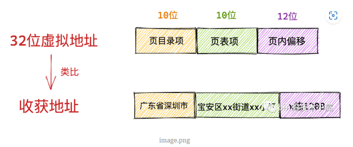
>进程虚拟内存空间中的每一个字节都有与其对应的虚拟内存地址，一个虚拟内存地址表示进程虚拟内存空间中的一个特定的字节。

## Linux系统为什么要用虚拟内存
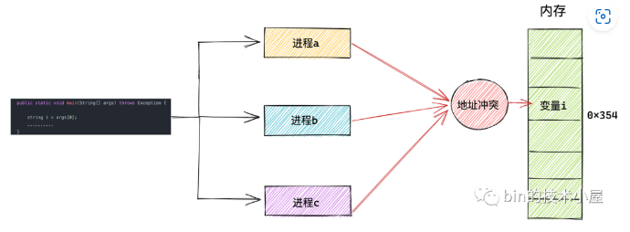
所以在直接操作物理内存的情况下，我们需要知道每一个变量的位置都被安排在了哪里，而且还要注意和多个进程同时运行的时候，不能共用同一个地址，否则就会造成地址冲突。
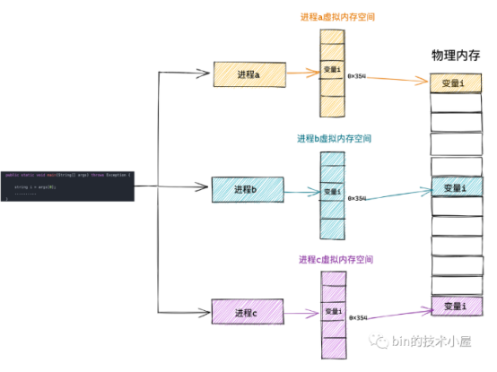
为每个进程分配内存空间，内存空间独立，这样访问相同的地址但是物理内存也不一样
### 程序局部性原理
程序局部性原理表现为：时间局部性和空间局部性。时间局部性是指如果程序中的某条指令一旦执行，则不久之后该指令可能再次被执行；如果某块数据被访问，则不久之后该数据可能再次被访问。空间局部性是指一旦程序访问了某个存储单元，则不久之后，其附近的存储单元也将被访问。

1. 什么是局部性原理
简单来说就是一个变量在程序运行过程中，如果被引用过一次，那后续很有可能会再被引用到；一个变量被访问到过后，这个变量所在的位置附近的位置很有可能在程序后续运行中被访问到。
```c
public int sum(int[] array) {
        int sum = 0;
        for (int i = 0; i < array.length; i++) {
            sum = sum + array[i];
        }
        return sum;
}
从上面的这段代码来看，就是一个很简单的数组元素求和，这里我们主要看 sum 和 array 两个变量，我们可以看到 sum 在每次循环中都会用到，另外它只是一个简单变量，所以我们可以看到，sum 是符合我们上面提到的时间局部性，再访问一次后还会被继续访问到，但是它不存在我们所说的空间局部性了。
相反的，array 数组中的每个元素只访问一次，另外数组底层的存储是连续的，所以 array 变量符合我们上面提到的空间局部性，但是不符合时间局部性。
这只是局部性原理的简单示例，对于局部性原理还有很多地方会用到，我们如果能熟练的掌握和使用，对我们的帮助会很大的。
```
在某一段时间内，进程真正需要的物理内存其实是很少的一部分，我们只需要为每个进程分配很少的物理内存就可以保证进程的正常执行运转。

```c
假设M=2  N=3；数组如下所示
1 2 3
4 5 6
在内存中的顺序1 2 3 4 5 6
良好局部性的例子
int sum_arry(int a[M][N])
{
   int i,j,sum = 0;
   for(i = 0;i<M;i++)
   {
      for(j = 0;j<N;j++)
      {
         sum+=a[M][N];
      }
   }
   return sum;
}
累加顺序1 2 3 4 5 6

不良局部性的例子
int sum_arry(int a[M][N])
{
   int i,j,sum = 0;
   for(i = 0;i<N;i++)
   {
      for(j = 0;j<M;j++)
      {
         sum+=a[M][N];
      }
   }
   return sum;
}
累加顺序1 4 2 5 3 6，因为使用步长为N的引用模式

```

## Linux 进程虚拟内存空间
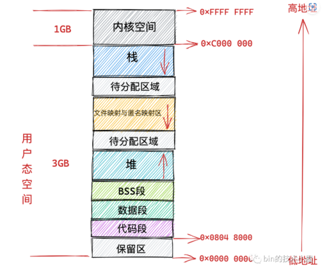
用于存放进程程序二进制文件中的机器指令的代码段
用于存放程序二进制文件中定义的全局变量和静态变量的数据段和 BSS 段。
用于在程序运行过程中动态申请内存的堆。
用于存放动态链接库以及内存映射区域的文件映射与匿名映射区。
用于存放函数调用过程中的局部变量和函数参数的栈。
`__PAGE_OFFSET 0xC000 000`

## 进程虚拟内存空间的整理
```c
struct task_struct {
        // 进程id
     pid_t    pid;
        // 用于标识线程所属的进程 pid
     pid_t    tgid;
        // 进程打开的文件信息
        struct files_struct  *files;
        // 内存描述符表示进程虚拟地址空间
        struct mm_struct  *mm;

        .......... 省略 .......
}
```
专门描述进程虚拟地址空间的内存描述符 mm_struct,每个进程都有唯一的 mm_struct 结构体

fork()函数 拷贝父进程的虚拟内存空间 mm_struct 结构。这里可以看出子进程在新创建出来之后它的虚拟内存空间是和父进程的虚拟内存空间一模一样的，直接拷贝过来。

**是否共享地址空间几乎是进程和线程之间的本质区别。Linux 内核并不区别对待它们，线程对于内核来说仅仅是一个共享特定资源的进程而已。**

### 内核如何布局进程虚拟内存空间
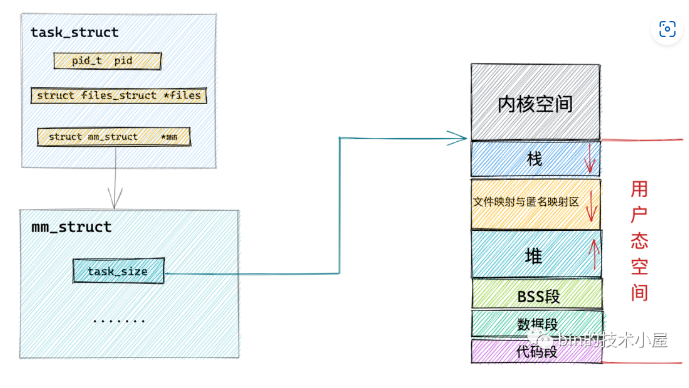
```c
struct mm_struct {
    unsigned long task_size;    /* size of task vm space */
    unsigned long start_code, end_code, start_data, end_data;
    unsigned long start_brk, brk, start_stack;
    unsigned long arg_start, arg_end, env_start, env_end;
    unsigned long mmap_base;  /* base of mmap area */
    unsigned long total_vm;    /* Total pages mapped */
    unsigned long locked_vm;  /* Pages that have PG_mlocked set */
    unsigned long pinned_vm;  /* Refcount permanently increased */
    unsigned long data_vm;    /* VM_WRITE & ~VM_SHARED & ~VM_STACK */
    unsigned long exec_vm;    /* VM_EXEC & ~VM_WRITE & ~VM_STACK */
    unsigned long stack_vm;    /* VM_STACK */

       ...... 省略 ........
}
```
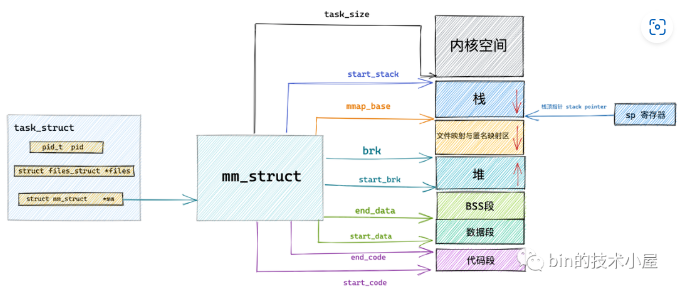
**注意映射这个概念，它表示只是将虚拟内存与物理内存建立关联关系，并不代表真正的分配物理内存。**

### 内核如何管理虚拟内存区域
```c
struct vm_area_struct {

 unsigned long vm_start;  /* Our start address within vm_mm. */
 unsigned long vm_end;  /* The first byte after our end address
        within vm_mm. */
 /*
  * Access permissions of this VMA.
  */
 pgprot_t vm_page_prot;
 unsigned long vm_flags; 

 struct anon_vma *anon_vma; /* Serialized by page_table_lock */
    struct file * vm_file;  /* File we map to (can be NULL). */
 unsigned long vm_pgoff;  /* Offset (within vm_file) in PAGE_SIZE
        units */ 
 void * vm_private_data;  /* was vm_pte (shared mem) */
 /* Function pointers to deal with this struct. */
 const struct vm_operations_struct *vm_ops;
}
```
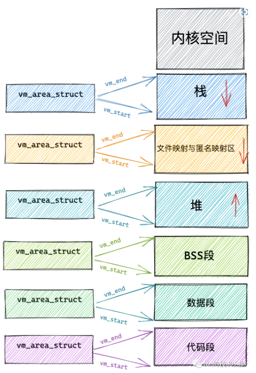

### 虚拟内存空间在内核中如何被组织起来
在内核中其实是通过一个 struct vm_area_struct 结构的双向链表将虚拟内存空间中的这些虚拟内存区域 VMA 串联起来的
```c
struct vm_area_struct {
struct vm_area_struct *vm_next, *vm_prev;
struct rb_node vm_rb;
struct list_head anon_vma_chain; 
struct mm_struct *vm_mm; /* The address space we belong to. */
 
unsigned long vm_start;     /* Our start address within vm_mm. */
unsigned long vm_end;       /* The first byte after our end addresswithin vm_mm. */
    /*
     * Access permissions of this VMA.
     */
    pgprot_t vm_page_prot;
    unsigned long vm_flags; 

    struct anon_vma *anon_vma;  /* Serialized by page_table_lock */
    struct file * vm_file;      /* File we map to (can be NULL). */
    unsigned long vm_pgoff;     /* Offset (within vm_file) in PAGE_SIZE units */ 
    void * vm_private_data;     /* was vm_pte (shared mem) */
    /* Function pointers to deal with this struct. */
    const struct vm_operations_struct *vm_ops;
}
```
双向链表的头指针存储在内存描述符 struct mm_struct 结构中的 mmap 中，正是这个 mmap 串联起了整个虚拟内存空间中的虚拟内存区域。
```c
struct mm_struct {
    struct vm_area_struct *mmap;  /* list of VMAs */
}
```
在每个虚拟内存区域 VMA 中又通过 struct vm_area_struct 中的 vm_mm 指针指向了所属的虚拟内存空间 mm_struct。

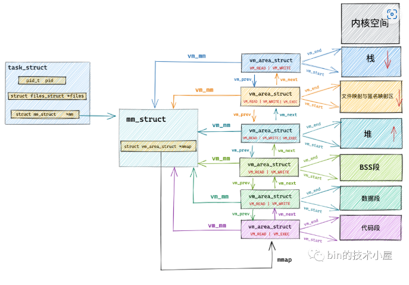
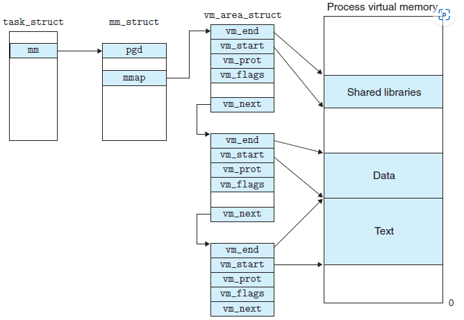

## 内核虚拟内存空间

**由于内核会涉及到物理内存的管理，所以很多人会想当然地认为只要进入了内核态就开始使用物理地址了，这就大错特错了，千万不要这样理解，进程进入内核态之后使用的仍然是虚拟内存地址，只不过在内核中使用的虚拟内存地址被限制在了内核态虚拟内存空间范围中**

### 直接映射区
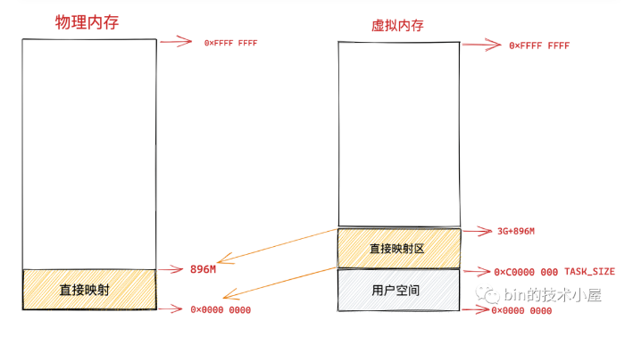
>虽然这块区域中的虚拟地址是直接映射到物理地址上，但是内核在访问这段区域的时候还是走的虚拟内存地址，内核也会为这块空间建立映射页表。关于页表的概念笔者后续会为大家详细讲解，这里大家只需要简单理解为页表保存了虚拟地址到物理地址的映射关系即可。

在这段 896M 大小的物理内存中，前 1M 已经在系统启动的时候被系统占用，1M 之后的物理内存存放的是内核代码段，数据段，BSS 段（这些信息起初存放在 ELF格式的二进制文件中，在系统启动的时候被加载进内存）。

比如在 X86 体系结构下，ISA 总线的 DMA （直接内存存取）控制器，只能对内存的前16M 进行寻址，这就导致了 ISA 设备不能在整个 32 位地址空间中执行 DMA，只能使用物理内存的前 16M 进行 DMA 操作。
因此直接映射区的前 16M 专门让内核用来为 DMA 分配内存，这块 16M 大小的内存区域我们称之为 ZONE_DMA。
>用于 DMA 的内存必须从 ZONE_DMA 区域中分配。

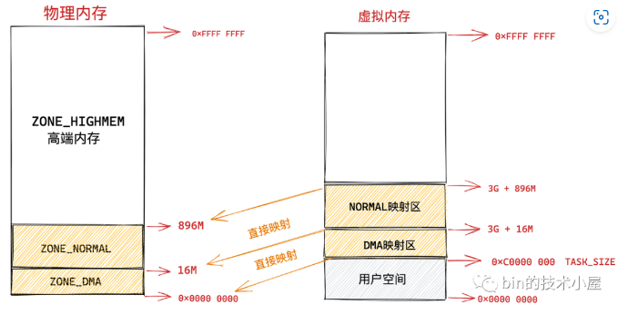
>注意这里的 ZONE_DMA 和 ZONE_NORMAL 是内核针对物理内存区域的划分
### ZONE_HIGHMEM高端内存

物理内存剩余`4G - 896M = 3200M`,虚拟内存剩余`1G - 896M = 128M`
物理和虚拟内存之间是动态映射的
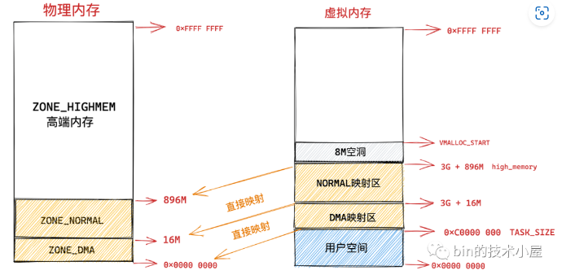
### vmalloc 动态映射区
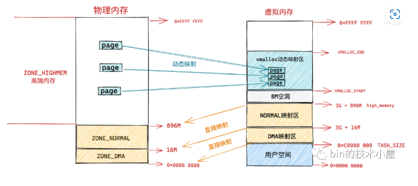
动态映射的原因，vmalloc 分配的内存在虚拟内存上是连续的，但是物理内存是不连续的。通过页表来建立物理内存与虚拟内存之间的映射关系，从而可以将不连续的物理内存映射到连续的虚拟内存上。
>由于 vmalloc 获得的物理内存页是不连续的，因此它只能将这些物理内存页一个一个地进行映射，在性能开销上会比直接映射大得多。
### 永久映射区
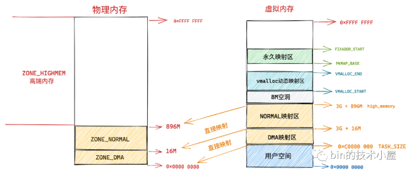
在 PKMAP_BASE 到 FIXADDR_START 之间的这段空间称为永久映射区。在内核的这段虚拟地址空间中允许建立与物理高端内存的长期映射关系。比如内核通过 alloc_pages() 函数在物理内存的高端内存中申请获取到的物理内存页，这些物理内存页可以通过调用 kmap 映射到永久映射区中。
### 固定映射区
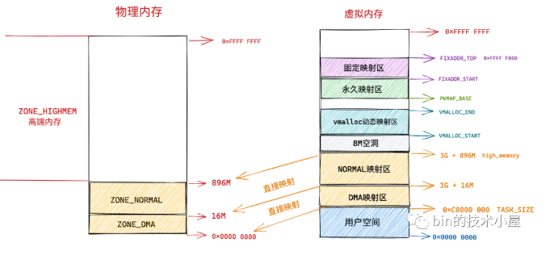
在固定映射区中虚拟地址是固定的，而被映射的物理地址是可以改变的。也就是说，有些虚拟地址在编译的时候就固定下来了，是在内核启动过程中被确定的，而这些虚拟地址对应的物理地址不是固定的。采用固定虚拟地址的好处是它相当于一个指针常量（常量的值在编译时确定），指向物理地址，如果虚拟地址不固定，则相当于一个指针变量。
### 临时映射区

### 32位体系结构下 Linux 虚拟内存空间整体布局
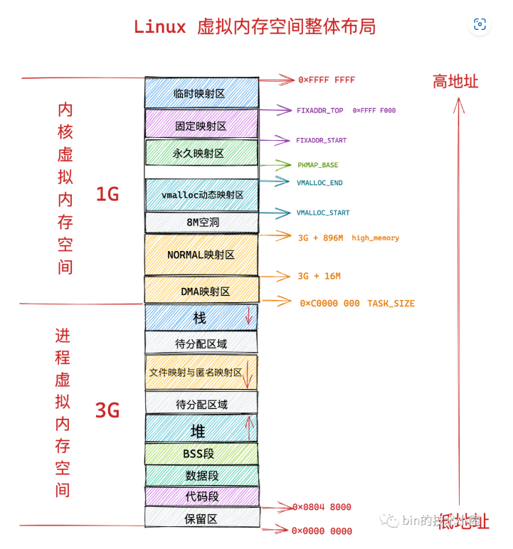

## 到底什么是物理内存地址
一类是静态 RAM（ SRAM ），这类 SRAM 用于 CPU 高速缓存 L1Cache，L2Cache，L3Cache。其特点是访问速度快，访问速度为 1 - 30 个时钟周期，但是容量小，造价高

另一类则是动态 RAM ( DRAM )，这类 DRAM 用于我们常说的主存上，其特点的是访问速度慢（相对高速缓存），访问速度为 50 - 200 个时钟周期，但是容量大，造价便宜些（相对高速缓存）。

### CPU 从内存读取数据过程
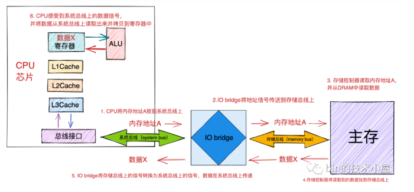
1. CPU将内存地址A放到系统总线上
2. IO bridge将地址信号传送到存储总线上
3. 存储控制器读取内存地址A并从DRAM中读取数据
4. 存储控制器将读取的数据放到存储总线上
5. IO bridge将存储总线上的信号转换为系统总线上的信号，数据在系统总线上传递
6. CPU感受到系统总线上的数据信号，并将数据从系统总线上读取出来并拷贝到寄存器中


## cache
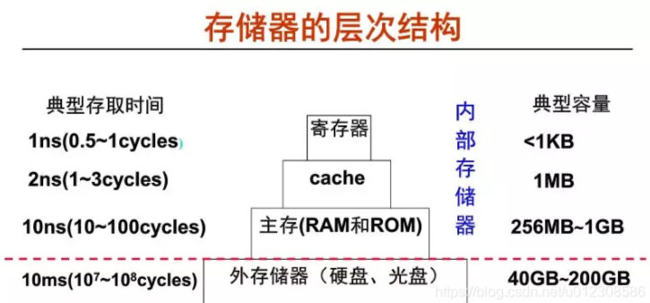
从上图可以看到，速度越快则容量越小、越靠近 CPU。CPU 可以直接访问内部存储器。而外部存储器的信息则要先取到主存，然后才能被 CPU 访问。CPU 执行指令时，需要的操作数大部分来自寄存器，当需要对存储器进行读写操作时，先访问 cache ，如果不在 cache 中，则访问主存，如果不在主存中，则访问硬盘。此时，操作数从硬盘中读出送到主存，然后从主存送到 cache。
由于 CPU 和主存所使用的半导体器件工艺不同，两者速度上的差异导致快速的 CPU 等待慢速的存储器，为此需要想办法提高 CPU 访问主存的速度。除了提高 DRAM 芯片本身的速度和采用并行结构技术以外，加快 CPU 访存速度的主要方式之一是在 CPU 和主存之间增加高速缓冲器，也就是我们主角 Cache。

Cache 位于 CPU 和内存之间，可以节省 CPU 从外部存储器读取指令和数据的时间
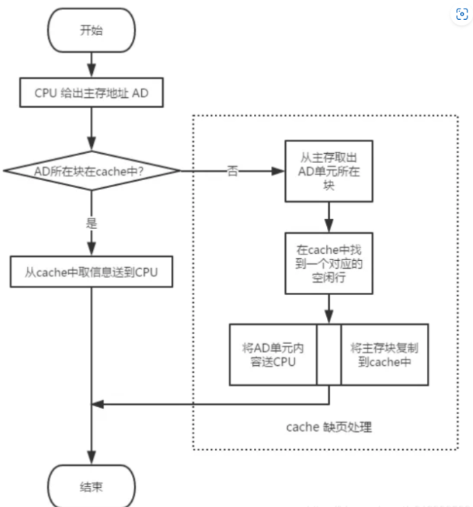

**从功能上来讲类比做菜，CPU是厨师，cache类比灶台，主存类比厨房，外设存储类比菜市场，我们做菜拿灶台的食物比较顺手，但是灶台很小只能放一部分食物，如果需要拿别的食物我们需要从厨房、菜市场寻找。如何能快读的做完一道菜，答：把做一道菜相关的食物都放在灶台上，我们做猪肉很容易想到加点粉条，所以就把粉条也放在灶台上（程序的局部性），快速的做完猪肉炖粉条。**
