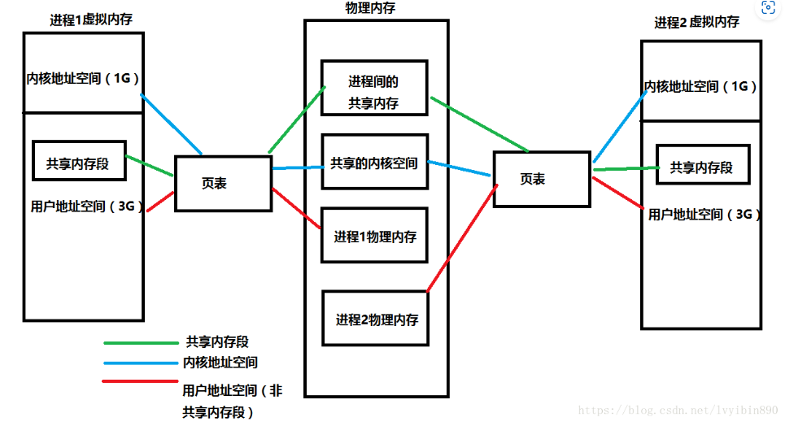
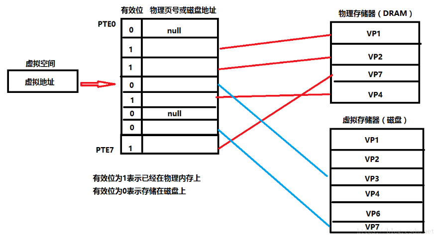
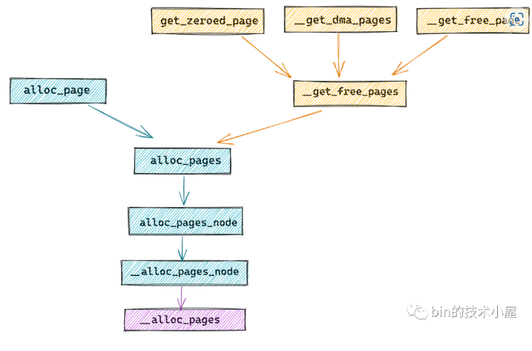

# 进程分配物理内存
1. **一个进程运行时都会得到4G的虚拟内存。这个只是虚拟的，并未分配实际的物理内存，类似于只是一个建筑设计图，并未变成房子。进程得到的这4G虚拟内存是一个连续的地址空间**。
1. 每次我要访问地址空间上的某一个地址，都需要把地址翻译为实际物理内存地址
所有进程共享这整一块物理内存，每个进程只把自己目前需要的虚拟地址空间映射到物理内存上
2. 进程需要知道哪些地址空间上的数据在物理内存上，哪些不在（可能这部分存储在磁盘上），还有在物理内存上的哪里，这就需要通过页表来记录
页表的每一个表项分两部分，第一部分记录此页是否在物理内存上，第二部分记录物理内存页的地址（如果在的话）
3. 当进程访问某个虚拟地址的时候，就会先去看页表，如果发现对应的数据不在物理内存上，就会发生缺页异常
4. 缺页异常的处理过程，操作系统立即阻塞该进程，并将硬盘里对应的页换入内存，然后使该进程就绪，如果内存已经满了，没有空地方了，那就找一个页覆盖，至于具体覆盖的哪个页，就需要看操作系统的页面置换算法是怎么设计的了。




我们的cpu想访问虚拟地址所在的虚拟页(VP3)，根据页表，找出页表中第三条的值.判断有效位。 如果有效位为1，DRMA缓存命中，根据物理页号，找到物理页当中的内容，返回。
若有效位为0，参数缺页异常，调用内核缺页异常处理程序。内核通过页面置换算法选择一个页面作为被覆盖的页面，将该页的内容刷新到磁盘空间当中。然后把VP3映射的磁盘文件缓存到该物理页上面。然后页表中第三条，有效位变成1，第二部分存储上了可以对应物理内存页的地址的内容。
缺页异常处理完毕后，返回中断前的指令，重新执行，此时缓存命中，执行1。
将找到的内容映射到告诉缓存当中，CPU从告诉缓存中获取该值，结束。

既然每个进程的内存空间都是一致而且固定的（32位平台下都是4G），所以链接器在链接可执行文件时，可以设定内存地址，而不用去管这些数据最终实际内存地址，这交给内核来完成映射关系
当不同的进程使用同一段代码时，比如库文件的代码，在物理内存中可以只存储一份这样的代码，不同进程只要将自己的虚拟内存映射过去就好了，这样可以节省物理内存

>https://blog.csdn.net/lvyibin890/article/details/82217193


# Linux物理内存分配全链路实现

## 内核物理内存分配接口
`struct page *alloc_pages(gfp_t gfp, unsigned int order);`
`#define alloc_page(gfp_mask) alloc_pages(gfp_mask, 0)`
>vmalloc 分配机制底层就是用的 alloc_page
```c
unsigned long __get_free_pages(gfp_t gfp_mask, unsigned int order)
{
 struct page *page;
    // 不能在高端内存中分配物理页，因为无法直接映射获取虚拟内存地址
 page = alloc_pages(gfp_mask & ~__GFP_HIGHMEM, order);
 if (!page)
  return 0;
    // 将直接映射区中的物理内存页转换为虚拟内存地址
 return (unsigned long) page_address(page);
}

#define __get_free_page(gfp_mask) \
  __get_free_pages((gfp_mask), 0)

unsigned long __get_dma_pages(gfp_t gfp_mask, unsigned int order);
```
**page_address 函数用于将给定的物理内存页 page 转换为它的虚拟内存地址，不过这里只适用于内核虚拟内存空间中的直接映射区**
如果物理内存页处于高端内存中，则不能这样直接进行转换，在通过 alloc_pages 函数获取物理内存页 page 之后，需要调用 kmap 映射将 page 映射到内核虚拟地址空间中。
`virt_to_phys()//内核虚拟地址转化为物理地址`
`phys_to_virt()//物理地址转化为内核虚拟地址`


### 内核空间内存动态申请
`void *kmalloc(size_t size,int flags);`
flags其中有两个常用的宏定义，GFP_KERNE,这个宏定义会引起休眠，不能在自旋锁或者中断上下文环境中。

`void *vmalloc(unsigned long size)`
vmalloc()的虚拟地址和物理地址并不是简单的线性映射关系

### slab

1. 创建slab缓存
```c
struct kmem_cache *kmem_cache_create(
const char*name,size_t size,
size_t align,unsigned long flags,
void (*ctro)(void*,struct kmem_cache*,unsigned long),
void (*dtro)(void*,struct kmem_cache*,unsigned long)
);
用于创建一个slab缓存
宏定义SLAB_HWCACHE_ALIGN/SLAB_CACHE_DMA
```
2. 分配slab缓存
```c
void *kmem_cache_alloc(struct kmem_cache*cachep,gfp flags)
创建slab后备缓存，并返回首地址指针
```
3. 释放slab缓存
```c
int kmem_cache_free(struct kmem_cache* cachep,void *objp)
```
4. 收回slab缓存
```c
int kmem_cache_destroy(struct kmem_cache* cachep)
```

```c
创建slab缓存
static kmem_cache_t * xxx_cachep;
xxx_cachep = kmem_cache_create("xxx",sizeof(xxx),0,SLAB_HWCACHE_ALIGN|SLAB_PANIC,NULL,NULL);
struct xxx *ctx;
ctx = kmem_cache_alloc(xxx_cachep,GFP_KERNEL);
/**释放slab缓冲**/
kmem_cache_free(xxx_cachep,ctx);
kmem_cache_destroy(xxx_cachep);
```
参考资料：
>https://www.jianshu.com/p/95d68389fbd1
>
### 内存池
```c
1. 创建内存池
mempool_t *mempool_create(int min_nr,mempoll_alloc_t *alloc_fn,mempool_free_t *free_fn,void *pool_data);
typedef void *(mempool_alloc_t)(int gfp_mask,void *poll_data);
typedef void *(mempool_free_t)(void *element,void *poll_data);

2. 分配内存池
void *mempool_alloc(mempool_t *pool,int gfp_mask);
void *mempool_free(void* element,mempool_t *pool);
3. 回收内存池
void mempoll_destroy(mempool_t *pool);
```
## 设备IO端口和IO内存的访问
IO内存 内核访问外设寄存器，需要首先使用ioremap()函数将设备所处的物理地址映射到虚拟地址
```c
void * ioremap(unsigned long offset,unsigned long size);
返回一个特殊的虚拟地址，该地址可用于存储特定的物理地址范围，这个虚拟地址位于vmalloc

void iounmap(void* addr);
读寄存器API
#define readb(c)//8位寄存器
#define readw(c)//16位寄存器
#define readl(c)//32位寄存器

写寄存器API
#define writeb(c)//8位寄存器
#define writew(c)//16位寄存器
#define writel(c)//32位寄存器
```

## DMA
### dma和cache一致性
DMA的目标地址与cache对象有重叠，DMA将外设数据复制到cache不经过cpu，所以cpu仍然认为cache里面的还是老的数据，这种现象称为cache与内存的不一致性。

### linux下DMA编程
使用DMA拷贝数据，需要申请DMA区间内存
```c
static unsigned long dma_mem_alloc(int size)
{
int order = get_order(size);
return __get_dma_pages(GFP_KERNEL,order);
}
```
#### 虚拟地址，物理地址，总线地址
总线地址和虚拟地址之间的转换
```c
unsigned long virt_to_bus(volatile void *address);
void *bus_to_virt(unsigned long address);
```

#### DMA地址掩码
设备地址并不一定能在所有地址上执行DMA操作，具体的操作函数
`int dma_set_mask(struct device*dev,u64 mask)`
`int arm_dma_set_mask(struct device*dev,u64 mask)`

#### 一致性DMA缓冲区
DMA映射包括两个方面工作，分配一片DMA缓冲区，DMA映射考虑cache一致性
`void * dma_alloc_coherent(struct device *dev,size_t size,dma_addr_t *handle,gfp_t gfp)`
`void dma_free_coherent(struct device *dev,size_t size,void * cpu_addr,dma_addr_t handle)`
分配一个写合并的DMA缓冲区
`void * dma_alloc_writecombine(struct device *dev,size_t size,dma_addr_t *handle,gfp_t gfp)`
`void dma_free_writecombine(struct device *dev,size_t size,void * cpu_addr,dma_addr_t handle)`

提供PCI设备申请DMA缓冲区的函数
`void * pci_alloc_consistent(struct pci_dev *pdev,size_t size,dma_addr_t * dma_addrp)`
`void * pci_free_consistent(struct pci_dev *pdev,size_t size,dma_addr_t * dma_addrp)`

**后续一些DMA操作，用到的时候再学习印象更深刻**


