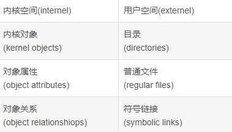
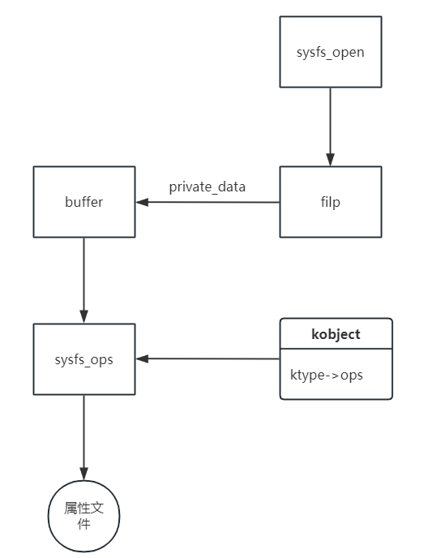
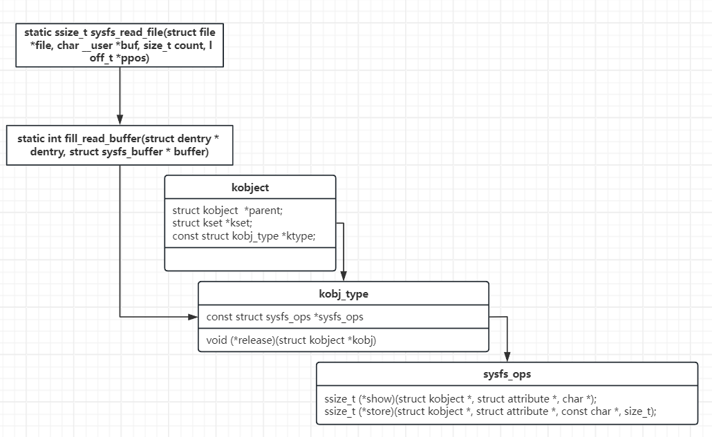

# kobject&kset
sysfs是一个基于RAM的文件系统，它和Kobject一起，可以将Kernel的数据结构导出到用户空间，以文件目录结构的形式，提供对这些数据结构（以及数据结构的属性）的访问支持。


## kobject
每一个Kobject，都会对应sysfs中的一个目录
```c
#include <linux/kobject.h>
struct kobject {
    const char      *name; /* kobject对象的名字，对应sysfs中的目录名 */
    struct list_head    entry; /* 在kset中的链表节点 */
    struct kobject      *parent; /* 用于构建sysfs中kobjects的层次结构，指向父目录 */
    struct kset     *kset; /* 所属kset */
    struct kobj_type    *ktype; /* 特定对象类型相关，用于跟踪object及其属性 */
    struct sysfs_dirent *sd; /* 指向该目录的dentry私有数据 */
    struct kref     kref; /* kobject的引用计数，初始值为1 */
    unsigned int state_initialized:1; /* kobject是否初始化，由kobject_init()设置 */
    unsigned int state_in_sysfs:1; /* 是否已添加到sysfs层次结构中 */
    unsigned int state_add_uevent_sent:1;
    unsigned int state_remove_uevent_sent:1;
    unsigned int uevent_suppress:1; /* 是否忽略uevent事件 */
};
```

1. 初始化一个kobject对象
```c
void kobject_init(struct kobject *kobj, const struct kobj_type *ktype)
{
...
	kobject_init_internal(kobj);
	kobj->ktype = ktype;
	return;
...
}
```
2. 初始化后，通过通过kobject_add()将kobj添加到系统中
```c
int kobject_add(struct kobject *kobj, struct kobject *parent,const char *fmt, ...)
{
...
	retval = kobject_add_varg(kobj, parent, fmt, args);
	va_end(args);
	return retval;
}

这个函数给kobj指定一个名字，这个名字也就是其在sysfs中的目录名，
parent用来指明kobj的父节点，即指定了kobj的目录在sysfs中创建的位置。
如果这个kobj要加入到一个特定的kset中，则在`kobject_add()`必须给 `kobj->kset` 赋值，此时parent可以设置为NULL，这样kobj会自动将`kobj->kset`对应的对象作为自己的parent。
如果parent设置为NULL，且没有加入到一个kset中，kobject会被创建到/sys顶层目录下。

```
2.1 设置对象名字
`int kobject_set_name(struct kobject *kobj, const char *fmt, ...);`
2.2 相应的获取一个kobject对象的名字的接口为
`const char *kobject_name(const struct kobject * kobj);`


```c
#include <linux/kobject.h>
struct kobj_type {
void (*release)(struct kobject *kobj);
const struct sysfs_ops *sysfs_ops;
struct attribute **default_attrs;
const struct kobj_ns_type_operations *(*child_ns_type)(struct kobject *kobj);
const void *(*namespace)(struct kobject *kobj);
};
```

## attribute
### attribute功能概述
所谓的attibute，就是内核空间和用户空间进行信息交互的一种方法。例如某个driver定义了一个变量，却希望用户空间程序可以修改该变量，以控制driver的运行行为，那么就可以将该变量以sysfs attribute的形式开放出来。
default_attrs定义了一系列默认属性，default_attrs是一个二级指针，可以对每个kobject设置多个默认属性（最后一个属性用NULL填充）。

```c
/* include/linux/sysfs.h, line 26 */
struct attribute {
    const char *name;
    umode_t         mode;
#ifdef CONFIG_DEBUG_LOCK_ALLOC
    bool ignore_lockdep:1;
    struct lock_class_key   *key;
    struct lock_class_key   skey;
#endif
 };
  
 /* include/linux/sysfs.h, line 100 */
 struct bin_attribute {
     struct attribute    attr;
     size_t          size;
     void *private;
     ssize_t (*read)(struct file *, struct kobject *, struct bin_attribute *,char *, loff_t, size_t);
     ssize_t (*write)(struct file *,struct kobject *, struct bin_attribute *,char *, loff_t, size_t);
     int (*mmap)(struct file *, struct kobject *, struct bin_attribute *attr,struct vm_area_struct *vma);
 };
 ```
struct attribute为普通的attribute，使用该attribute生成的sysfs文件，只能用字符串的形式读写（后面会说为什么）。而struct bin_attribute在struct attribute的基础上，增加了read、write等函数，因此它所生成的sysfs文件可以用任何方式读写。

说完基本概念，我们要问两个问题：
Kernel怎么把attribute变成sysfs中的文件呢？
用户空间对sysfs的文件进行的读写操作，怎么传递给Kernel呢？
```c
struct attribute {
    const char      *name; /* 属性名字 */
    umode_t         mode; /* 用户访问模式，在<linux/stat.h>中定义 */
};
```
```c
static struct attribute *i2c_adapter_attrs[] = {
    &dev_attr_name.attr,
    &dev_attr_new_device.attr,
    &dev_attr_delete_device.attr,
    NULL
};
```


### attibute文件的read和write
**在linux内核中，attibute文件的创建是由fs/sysfs/file.c中sysfs_create_file接口完成的，该接口的实现没有什么特殊之处，大多是文件系统相关的操作，和设备模型没有太多的关系**

查看struct attribute的原型时，没有发现可对其操作的接口，那文件操作的接口在哪里呢？
```c
/* fs/sysfs/file.c, line 127 */
static ssize_t sysfs_read_file(struct file *file, char __user *buf, size_t count, loff_t *ppos)
{
    struct sysfs_buffer * buffer = file->private_data;
    ssize_t retval = 0;
 
    mutex_lock(&buffer->mutex);
    if (buffer->needs_read_fill || *ppos == 0) {
        retval = fill_read_buffer(file->f_path.dentry,buffer);
        if (retval)
            goto out;
    }
 ...
 }
 /* fs/sysfs/file.c, line 67 */
 static int fill_read_buffer(struct dentry * dentry, struct sysfs_buffer * buffer)
 {           
    struct sysfs_dirent *attr_sd = dentry->d_fsdata;
    struct kobject *kobj = attr_sd->s_parent->s_dir.kobj;
    const struct sysfs_ops * ops = buffer->ops;
    ...        
    count = ops->show(kobj, attr_sd->s_attr.attr, buffer->page);
    ...
 }
 ```
**sysfs_read_file->fill_read_buffer->sysfs_ops->ops->show**
sysfs_ops 从哪里来
```c
static int sysfs_open_file(struct inode *inode, struct file *file)
{
...
    /* every kobject with an attribute needs a ktype assigned */
    if (kobj->ktype && kobj->ktype->sysfs_ops)
        ops = kobj->ktype->sysfs_ops;
...
}
```
sysfs_ops 从kobj->ktype->sysfs_ops中来
```c
struct kobj_type {
	void (*release)(struct kobject *kobj);
	const struct sysfs_ops *sysfs_ops;
	const struct attribute_group **default_groups;
	const struct kobj_ns_type_operations *(*child_ns_type)(const struct kobject *kobj);
	const void *(*namespace)(const struct kobject *kobj);
	void (*get_ownership)(const struct kobject *kobj, kuid_t *uid, kgid_t *gid);
};
const struct sysfs_ops *sysfs_ops;的原型
static const struct sysfs_ops foo_sysfs_ops = {
	.show = foo_attr_show,
	.store = foo_attr_store,
};

kobj和ktype之间的关系
retval = kobject_init_and_add(&foo->kobj, &foo_ktype, NULL, "%s", name);
void kobject_init(struct kobject *kobj, const struct kobj_type *ktype)
{
...
	if (!ktype) {
		err_str = "must have a ktype to be initialized properly!\n";
		goto error;
	}

	kobject_init_internal(kobj);
	kobj->ktype = ktype;
...
}

```


 
也就是说我们echo 和cat文件实际是调用 attibute 文件的store 和 show
调用关系
`user（read(dev_file)）->syscall(read)->vfs(file_operations.read)->sysfs(sysfs_file_operation.read->fill_read_buffer->sysfs_ops.show)->driver(xxx_sysfs_ops.show)`
 
## kset
kset就是一个集合管理kobject，内核将相互关联的kobjects放到一个kset中统一管理（一个kset中并没有要求其中每个kobject的ktype必须相同，但正常情况下总是相同的）
```c
struct kset {
    struct list_head list; /* 其成员列表 */
    spinlock_t list_lock;
    struct kobject kobj;
    const struct kset_uevent_ops *uevent_ops; /* 扩展的事件处理 */
};
```
使用kset可以统一管理某些kobjects，方便查找和遍历，kobject的entry成员将所有的同一集合中的成员连接起来。
另外我们看到，一个kset自身在内核中也是一个kobject对象，因此，一个kset在sysfs中也对应着一个目录，**这个kset的kobject可以作为其子目录的parent**，sysfs顶层目录的bus/、devices/等目录就是这样创建的。通常，一个目录下的所有子目录都是属于同一个kset的，例如/sys/bus/目录下的所有子目录都属于全局的bus_kset

```c
static struct kset *example_kset;
example_kset = kset_create_and_add("kset_example", NULL, kernel_kobj);
在sys文件夹下创建一个kset_example的文件夹

foo->kobj.kset = example_kset;
通过kset之间的关系 将foo文件夹放在 kset_example 文件夹目录下
```
