# linux platform
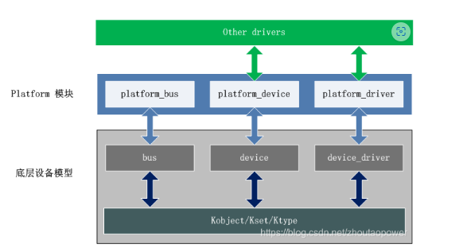
## platform 模块向其他模块提供的APIs
### 数据结构
#### platfrom_device
```c
include/linux/platform_device.h 文件
struct platform_device {
	const char	* name;
	int		id;
	struct device	dev;
	u32		num_resources;
	struct resource	* resource;
 
	const struct platform_device_id	*id_entry;
 
	/* MFD cell pointer */
	struct mfd_cell *mfd_cell;
 
	/* arch specific additions */
	struct pdev_archdata	archdata;
};
1. dev：真正的设备（Platform设备只是一个特殊的设备，因此其核心逻辑还是由底层的模块实现）。
1. name：设备的名称，和 struct device 结构中的 init_name 一样。实际上，该名称在设备注册时，会拷贝到 dev.init_name中。
1. id：用于表示该设备的 ID。
1. id_auto：指示在注册设备时，是否自动赋予ID值（不需要人为指定啦，可以懒一点啦）。
1. num_resources、resource：该设备的资源描述，由struct resource（include/linux/ioport.h）结构抽象。

```
#### platform_driver
```c
struct platform_driver {
	int (*probe)(struct platform_device *);
	int (*remove)(struct platform_device *);
	void (*shutdown)(struct platform_device *);
	int (*suspend)(struct platform_device *, pm_message_t state);
	int (*resume)(struct platform_device *);
	struct device_driver driver;
	const struct platform_device_id *id_table;
};
```
### APIs
#### Platform Device 提供的 APIs
1. 注册/注册一个platform设备
```c
int platform_device_register(struct platform_device *);
void platform_device_unregister(struct platform_device *);
 
int platform_add_devices(struct platform_device **, int); // 增加多个 devices
```
2. 获取资源
```c
struct resource *platform_get_resource(struct platform_device *,
                                       unsigned int, unsigned int);
 
struct resource *platform_get_resource_byname(struct platform_device *,
                                                     unsigned int,
                                                     const char *);
```
3. 获取irq
```c
int platform_get_irq(struct platform_device *, unsigned int);
int platform_get_irq_byname(struct platform_device *, const char *);
```
4. 向platfrom_device 增加资源
```c
int platform_device_add_resources(struct platform_device *pdev,
                                  const struct resource *res,
                                  unsigned int num);
```
5. 向 platform device 中添加自定义的数据（保存在pdev->dev.platform_data指针中）
```c
int platform_device_add_data(struct platform_device *pdev,
                             const void *data, size_t size);
```
#### platform driver 提供的APIs
1. 注册/注销platfrom_driver接口
```c
int platform_driver_register(struct platform_driver *);
void platform_driver_unregister(struct platform_driver *);
```
2. 主动执行probe动作接口
```c
int platform_driver_probe(struct platform_driver *driver,
                          int (*probe)(struct platform_device *));
```
3. 设置/获取私有接口
```c
inline void *platform_get_drvdata(const struct platform_device *pdev);
inline void platform_set_drvdata(struct platform_device *pdev,void *data)
```
## platfrom初始化
### platform总线初始化
`kernel_init() –> do_basic_setup() –> driver_init() –> platform_bus_init()`

```c
int __init platform_bus_init(void)
{
	int error;
 
	early_platform_cleanup();
 
	error = device_register(&platform_bus); ------- (1)
	if (error)
		return error;
	error =  bus_register(&platform_bus_type);  --- (2)
	if (error)
		device_unregister(&platform_bus);
	return error;
}
先看（1）部分，通过 device_register 它注册了一个 platform_bus 的设备，它的定义在 driver/base
struct device platform_bus = {
	.init_name	= "platform",
};
EXPORT_SYMBOL_GPL(platform_bus);
**定义一个名为 platform 的总线设备，其他的platform设备都是它的子设备**
在看（2）部分，通过 bus_register 注册了一个 platform_bus_type 的 bus
struct bus_type platform_bus_type = {
	.name		= "platform",
	.dev_attrs	= platform_dev_attrs,
	.match		= platform_match,
	.uevent		= platform_uevent,
	.pm		= &platform_dev_pm_ops,
};

注册平台类型的 bus，将出现 sys 文件系统在 bus 目录下，创建一个 platform 的目录，以及相关属性文件。
这里创建好 platform 的 bus 了，就等相关的设备驱动去注册自己的 platform_device 和 platform_driver
```
## device和driver匹配执行probe
在总线上 `device 和 driver` 的名字匹配，就会调用 `driver 的 probe` 函数；
那么就会存在一个问题，到底是先有 `device` 还是先有 `driver`，因为他们俩注册肯定是有先后顺序的，所以需要看看源代码

### platform_driver_register
```c
/**
 * platform_driver_register - register a driver for platform-level devices
 * @drv: platform driver structure
 */
int platform_driver_register(struct platform_driver *drv)
{
	drv->driver.bus = &platform_bus_type;
	if (drv->probe)
		drv->driver.probe = platform_drv_probe;
	if (drv->remove)
		drv->driver.remove = platform_drv_remove;
	if (drv->shutdown)
		drv->driver.shutdown = platform_drv_shutdown
 
	return driver_register(&drv->driver);
}
EXPORT_SYMBOL_GPL(platform_driver_register);
先实例化这个drv再进程注册driver_register

int driver_register(struct device_driver *drv)
{
	int ret;
	struct device_driver *other;

	other = driver_find(drv->name, drv->bus); ------------(1)
	ret = bus_add_driver(drv); ----------------------------(2)

}
EXPORT_SYMBOL_GPL(driver_register);
（1）第一部分
struct device_driver *driver_find(const char *name, struct bus_type *bus)
{
	struct kobject *k = kset_find_obj(bus->p->drivers_kset, name);
	struct driver_private *priv;
 
	if (k) {
		priv = to_driver(k);
		return priv->driver;
	}
	return NULL;
}
EXPORT_SYMBOL_GPL(driver_find);

struct kobject *kset_find_obj(struct kset *kset, const char *name)
{
	return kset_find_obj_hinted(kset, name, NULL);
}
 
struct kobject *kset_find_obj_hinted(struct kset *kset, const char *name,struct kobject *hint)
{
	struct kobject *k;
	struct kobject *ret = NULL;
.........
	list_for_each_entry(k, &kset->list, entry) {
		if (kobject_name(k) && !strcmp(kobject_name(k), name)) {
			ret = kobject_get(k);
			break;
		}
	}
.........
}
kset_find_obj通过循环操作，根据我们给的名字name在指定的bus中循环对比，查看是否有相同的名字name（这个name存放在kobj中）。其实这就是一个循环链表的遍历过程
所以，driver_find 通过我们给定的name在某bus中寻找驱动，比对名字，看看驱动是否已经装载
（2）bus_add_driver
int bus_add_driver(struct device_driver *drv)
{
	struct bus_type *bus;
	struct driver_private *priv;
	int error = 0;
 
	bus = bus_get(drv->bus);
	if (!bus)
		return -EINVAL;
....
	priv = kzalloc(sizeof(*priv), GFP_KERNEL);
....
	klist_init(&priv->klist_devices, NULL, NULL);
....
//这个 drv->bus->p->drivers_autoprobe，其实就是 platform_bus_type->subsys_private->drivers_autoprobe 的值，在platform_bus_init的时候，调用 bus_register 的时候，这个值没有设置，被默认设置成为了 1
// int bus_register(struct bus_type *bus)
// {
// ...
// 	priv->drivers_autoprobe = 1;
 
// }
	if (drv->bus->p->drivers_autoprobe) {
		error = driver_attach(drv);
		if (error)
			goto out_unregister;
	}
....
}

执行到driver_attach

int driver_attach(struct device_driver *drv)
{
    return bus_for_each_dev(drv->bus, NULL, drv, __driver_attach);
}
 
int bus_for_each_dev(struct bus_type *bus, struct device *start,
		     void *data, int (*fn)(struct device *, void *))
{
...
	while ((dev = next_device(&i)) && !error)
		error = fn(dev, data);
...
}

进而执行到 __driver_attach 函数
static int __driver_attach(struct device *dev, void *data)
{
	struct device_driver *drv = data;
 
	/*
	 * Lock device and try to bind to it. We drop the error
	 * here and always return 0, because we need to keep trying
	 * to bind to devices and some drivers will return an error
	 * simply if it didn't support the device.
	 *
	 * driver_probe_device() will spit a warning if there
	 * is an error.
	 */
 
	if (!driver_match_device(drv, dev))
		return 0;
 
	if (dev->parent)	/* Needed for USB */
		device_lock(dev->parent);
	device_lock(dev);
	if (!dev->driver)
		driver_probe_device(drv, dev);
	device_unlock(dev);
	if (dev->parent)
		device_unlock(dev->parent);
 
	return 0;
}


static inline int driver_match_device(struct device_driver *drv,
				      struct device *dev)
{
	return drv->bus->match ? drv->bus->match(dev, drv) : 1;
}

实际是执行了platform_match
static int platform_match(struct device *dev, struct device_driver *drv)
{
	struct platform_device *pdev = to_platform_device(dev);
	struct platform_driver *pdrv = to_platform_driver(drv);
 
	/* Attempt an OF style match first */
	if (of_driver_match_device(dev, drv))
		return 1;
 
	/* Then try to match against the id table */
	if (pdrv->id_table)
		return platform_match_id(pdrv->id_table, pdev) != NULL;
 
	/* fall-back to driver name match */
	return (strcmp(pdev->name, drv->name) == 0);
}

当 match 上了后，执行 __driver_attach 的 driver_probe_device 函数调用
int driver_probe_device(struct device_driver *drv, struct device *dev)
{...
	ret = really_probe(dev, drv);
...
}


static int really_probe(struct device *dev, struct device_driver *drv)
{
	int ret = 0;
...
	atomic_inc(&probe_count);
...
	dev->driver = drv;
...
	if (dev->bus->probe) {
		ret = dev->bus->probe(dev);
		if (ret)
			goto probe_failed;
	} else if (drv->probe) {
		ret = drv->probe(dev);
		if (ret)
			goto probe_failed;
	}
...
}

```
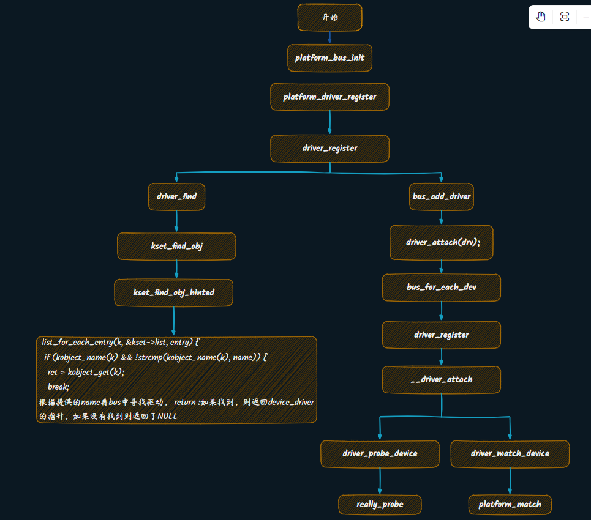

## platform设备驱动
```c
int platform_device_register(struct platform_device *pdev)
{
	device_initialize(&pdev->dev);
	return platform_device_add(pdev);
}
EXPORT_SYMBOL_GPL(platform_device_register);

先将 platform_device 的 device 结构初始化，然后调用 platform_device_add
int platform_device_add(struct platform_device *pdev)
{
...
	ret = device_add(&pdev->dev);
...
 
}
EXPORT_SYMBOL_GPL(platform_device_add);

设置 bus 为 platform bus type 后，算是挂靠到这个 bus 上，然后做一些初始化的动作，调用到 device_add，
int device_add(struct device *dev)
{
...
	error = bus_add_device(dev);
...
	bus_probe_device(dev);
...
}
这里关心到 bus_add_device 函数，往期望的 bus 上增加一个 device
int bus_add_device(struct device *dev)
{
	struct bus_type *bus = bus_get(dev->bus);
...
	klist_add_tail(&dev->p->knode_bus, &bus->p->klist_devices);
    //其中bus->p是一个subsys_private结构体指针
//struct subsys_private {
// 	struct klist klist_devices;
// 	struct klist klist_drivers
// };

}
增加成功后，调用 bus_probe_device
void bus_probe_device(struct device *dev)
{
	struct bus_type *bus = dev->bus;
	int ret;
 
	if (bus && bus->p->drivers_autoprobe) {
		ret = device_attach(dev);
		WARN_ON(ret < 0);
	}
}
device_attach类似于driver_attch
```
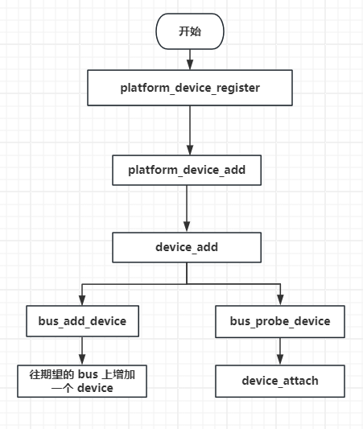


Linux platform_driver_register()调用关系
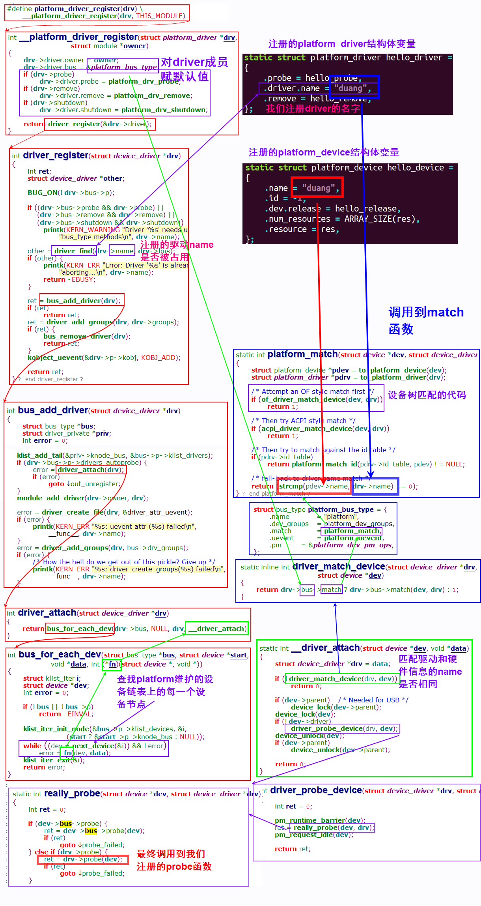


### platform 总线、设备、驱动
匹配platform_device和platform 有四种方式
1. 设备树匹配
2. ACPI风格匹配
3. 匹配ID表
4. 匹配platform_device设备名字和驱动名字
### platform 设备资源和数据
```c
struct resource
{
    resource__size_t start;
    resource_size_t end;
    const char* name;
    unsigned long flags;
    struct resource *parent,*sibling,*child;
}
flag:
IORESOURCE_IO;
IORESOURCE_MEM;
IORESOURCE_IRQ;
IORESOURCE_DMA;
资源设置和获取举例：
static struct resource char_resource[] = {
	[0] = {
		.start = MEME_ADDR,
		.end = MEME_ADDR + MEME_SIZE - 1,
		.flags = IORESOURCE_MEM,
	},
};

int char_resource_size = 0;
struct resource *char_source;
char_source = platform_get_resource(dev, IORESOURCE_MEM, 0);
char_resource_size = resource_size(char_source);
char_devp->mem = ioremap(char_source->start, char_resource_size);
```

### 杂项设备驱动
杂项设备驱动
miscdevice驱动结构
```c
static const struct file_operations xxx_ops = {
    .unlocked_ioctl = xxx_ioctl,
    .mmap = xxx_mmap,
};

static const struct miscdevice xxx_dev = {
    .minor = xxx_ioctl,
    .name = xxx_mmap,
    .fops = &xxx_ops,
};

static int __init xxx_init(void)
{
    pr_info(xxx);
    return misc_register(&xxx_dev);
}

```
### 驱动核心层

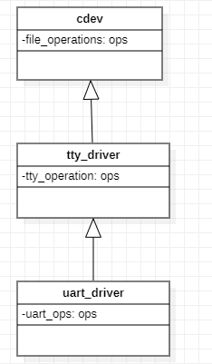

# spi驱动
## 硬件拓扑
一款SOC会有不同的SOC控制器，如下图所示有3个
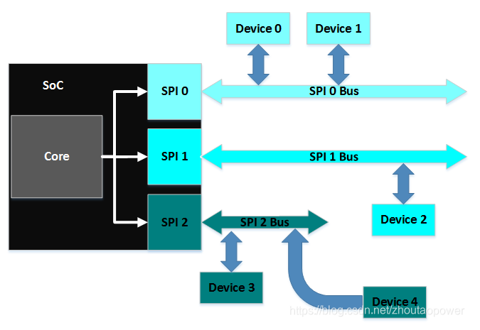
## 软件抽象
1. spi_master(spi_controller)：对 SoC 的 SPI 控制器的抽象
2. spi_bus_type：spi 的 bus_type，代表了硬件上的 SPI Bus
3. spi_device：spi 从设备
4. spi_driver：spi 具体设备的


### spi数据结构
```c
struct spi_controller {
	struct device	dev;
 
	struct list_head list;
 
	/* other than negative (== assign one dynamically), bus_num is fully
	 * board-specific.  usually that simplifies to being SOC-specific.
	 * example:  one SOC has three SPI controllers, numbered 0..2,
	 * and one board's schematics might show it using SPI-2.  software
	 * would normally use bus_num=2 for that controller.
	 */
	s16			bus_num;
 
	/* chipselects will be integral to many controllers; some others
	 * might use board-specific GPIOs.
	 */
	u16			num_chipselect;
 
	/* some SPI controllers pose alignment requirements on DMAable
	 * buffers; let protocol drivers know about these requirements.
	 */
	u16			dma_alignment;
 
	/* spi_device.mode flags understood by this controller driver */
	u16			mode_bits;
 
	/* bitmask of supported bits_per_word for transfers */
	u32			bits_per_word_mask;
#define SPI_BPW_MASK(bits) BIT((bits) - 1)
#define SPI_BIT_MASK(bits) (((bits) == 32) ? ~0U : (BIT(bits) - 1))
#define SPI_BPW_RANGE_MASK(min, max) (SPI_BIT_MASK(max) - SPI_BIT_MASK(min - 1))
 
	/* limits on transfer speed */
	u32			min_speed_hz;
	u32			max_speed_hz;
 
	/* other constraints relevant to this driver */
	u16			flags;
#define SPI_CONTROLLER_HALF_DUPLEX	BIT(0)	/* can't do full duplex */
#define SPI_CONTROLLER_NO_RX		BIT(1)	/* can't do buffer read */
#define SPI_CONTROLLER_NO_TX		BIT(2)	/* can't do buffer write */
#define SPI_CONTROLLER_MUST_RX		BIT(3)	/* requires rx */
#define SPI_CONTROLLER_MUST_TX		BIT(4)	/* requires tx */
 
#define SPI_MASTER_GPIO_SS		BIT(5)	/* GPIO CS must select slave */
 
	/* flag indicating this is an SPI slave controller */
	bool			slave;
 
	/*
	 * on some hardware transfer / message size may be constrained
	 * the limit may depend on device transfer settings
	 */
	size_t (*max_transfer_size)(struct spi_device *spi);
	size_t (*max_message_size)(struct spi_device *spi);
 
	/* I/O mutex */
	struct mutex		io_mutex;
 
	/* lock and mutex for SPI bus locking */
	spinlock_t		bus_lock_spinlock;
	struct mutex		bus_lock_mutex;
 
	/* flag indicating that the SPI bus is locked for exclusive use */
	bool			bus_lock_flag;
 
	/* Setup mode and clock, etc (spi driver may call many times).
	 *
	 * IMPORTANT:  this may be called when transfers to another
	 * device are active.  DO NOT UPDATE SHARED REGISTERS in ways
	 * which could break those transfers.
	 */
	int			(*setup)(struct spi_device *spi);
 
	/* bidirectional bulk transfers
	 *
	 * + The transfer() method may not sleep; its main role is
	 *   just to add the message to the queue.
	 * + For now there's no remove-from-queue operation, or
	 *   any other request management
	 * + To a given spi_device, message queueing is pure fifo
	 *
	 * + The controller's main job is to process its message queue,
	 *   selecting a chip (for masters), then transferring data
	 * + If there are multiple spi_device children, the i/o queue
	 *   arbitration algorithm is unspecified (round robin, fifo,
	 *   priority, reservations, preemption, etc)
	 *
	 * + Chipselect stays active during the entire message
	 *   (unless modified by spi_transfer.cs_change != 0).
	 * + The message transfers use clock and SPI mode parameters
	 *   previously established by setup() for this device
	 */
	int			(*transfer)(struct spi_device *spi,
						struct spi_message *mesg);
 
	/* called on release() to free memory provided by spi_controller */
	void			(*cleanup)(struct spi_device *spi);
 
	/*
	 * Used to enable core support for DMA handling, if can_dma()
	 * exists and returns true then the transfer will be mapped
	 * prior to transfer_one() being called.  The driver should
	 * not modify or store xfer and dma_tx and dma_rx must be set
	 * while the device is prepared.
	 */
	bool			(*can_dma)(struct spi_controller *ctlr,
					   struct spi_device *spi,
					   struct spi_transfer *xfer);
 
	/*
	 * These hooks are for drivers that want to use the generic
	 * controller transfer queueing mechanism. If these are used, the
	 * transfer() function above must NOT be specified by the driver.
	 * Over time we expect SPI drivers to be phased over to this API.
	 */
	bool				queued;
	struct kthread_worker		kworker;
	struct task_struct		*kworker_task;
	struct kthread_work		pump_messages;
	spinlock_t			queue_lock;
	struct list_head		queue;
	struct spi_message		*cur_msg;
	bool				idling;
	bool				busy;
	bool				running;
	bool				rt;
	bool				auto_runtime_pm;
	bool                            cur_msg_prepared;
	bool				cur_msg_mapped;
	struct completion               xfer_completion;
	size_t				max_dma_len;
 
	int (*prepare_transfer_hardware)(struct spi_controller *ctlr);
	int (*transfer_one_message)(struct spi_controller *ctlr,
				    struct spi_message *mesg);
	int (*unprepare_transfer_hardware)(struct spi_controller *ctlr);
	int (*prepare_message)(struct spi_controller *ctlr,
			       struct spi_message *message);
	int (*unprepare_message)(struct spi_controller *ctlr,
				 struct spi_message *message);
	int (*slave_abort)(struct spi_controller *ctlr);
 
	/*
	 * These hooks are for drivers that use a generic implementation
	 * of transfer_one_message() provied by the core.
	 */
	void (*set_cs)(struct spi_device *spi, bool enable);
	int (*transfer_one)(struct spi_controller *ctlr, struct spi_device *spi,
			    struct spi_transfer *transfer);
	void (*handle_err)(struct spi_controller *ctlr,
			   struct spi_message *message);
 
	/* Optimized handlers for SPI memory-like operations. */
	const struct spi_controller_mem_ops *mem_ops;
 
	/* gpio chip select */
	int			*cs_gpios;
 
	/* statistics */
	struct spi_statistics	statistics;
 
	/* DMA channels for use with core dmaengine helpers */
	struct dma_chan		*dma_tx;
	struct dma_chan		*dma_rx;
 
	/* dummy data for full duplex devices */
	void			*dummy_rx;
	void			*dummy_tx;
 
	int (*fw_translate_cs)(struct spi_controller *ctlr, unsigned cs);
};
dev：spi_controller 是一个 device，所以包含了一个 device 的实例，设备模型使用
list：链接到全局的 spi_controller list
bus_num：spi bus 的编号，比如某 SoC有3个 SPI 控制，那么这个结构描述的是第几个
num_chipselect：片选数量，决定该控制器下面挂接多少个SPI设备，从设备的片选号不能大于这个数量
mode_bits：SPI 控制器支持的 slave 的模式
min_speed_hz/max_speed_hz：最大最小速率
slave：是否是 slave
(*setup)：主要设置SPI控制器和工作方式、clock等
(*transfer)：添加消息到队列的方法。这个函数不可睡眠。它的职责是安排发生的传送并且调用注册的回调函 complete()。这个不同的控制器要具体实现，传输数据最后都要调用这个函数
(*cleanup)：在spidev_release函数中被调用，spidev_release被登记为spi dev的release函数
```


spi_device
```c
struct spi_device {
	struct device		dev;
	struct spi_controller	*controller;
	struct spi_controller	*master;	/* compatibility layer */
	u32			max_speed_hz;
	u8			chip_select;
	u8			bits_per_word;
	u16			mode;
#define	SPI_CPHA	0x01			/* clock phase */
#define	SPI_CPOL	0x02			/* clock polarity */
#define	SPI_MODE_0	(0|0)			/* (original MicroWire) */
#define	SPI_MODE_1	(0|SPI_CPHA)
#define	SPI_MODE_2	(SPI_CPOL|0)
#define	SPI_MODE_3	(SPI_CPOL|SPI_CPHA)
#define	SPI_CS_HIGH	0x04			/* chipselect active high? */
#define	SPI_LSB_FIRST	0x08			/* per-word bits-on-wire */
#define	SPI_3WIRE	0x10			/* SI/SO signals shared */
#define	SPI_LOOP	0x20			/* loopback mode */
#define	SPI_NO_CS	0x40			/* 1 dev/bus, no chipselect */
#define	SPI_READY	0x80			/* slave pulls low to pause */
#define	SPI_TX_DUAL	0x100			/* transmit with 2 wires */
#define	SPI_TX_QUAD	0x200			/* transmit with 4 wires */
#define	SPI_RX_DUAL	0x400			/* receive with 2 wires */
#define	SPI_RX_QUAD	0x800			/* receive with 4 wires */
#define SPI_CS_WORD	0x1000			/* toggle cs after each word */
	int			irq;
	void			*controller_state;
	void			*controller_data;
	char			modalias[SPI_NAME_SIZE];
	const char		*driver_override;
	int			cs_gpio;	/* chip select gpio */
 
	/* the statistics */
	struct spi_statistics	statistics;
 
	/*
	 * likely need more hooks for more protocol options affecting how
	 * the controller talks to each chip, like:
	 *  - memory packing (12 bit samples into low bits, others zeroed)
	 *  - priority
	 *  - chipselect delays
	 *  - ...
	 */
};

dev：device 结构，设备模型使用
controller：这个 spi device 挂在那个 SPI Controller 下
max_speed_hz：通讯时钟最大频率
chip_select：片选号，每个 master 支持多个 spi_device
mode：SPI device 的模式，时钟极性和时钟相位
bits_per_word：每个通信字的字长的比特数，默认是 8
irq：使用到的中断号
modalias：设备驱动的名字
```

spi_driver
```c
struct spi_driver {
	const struct spi_device_id *id_table;
	int			(*probe)(struct spi_device *spi);
	int			(*remove)(struct spi_device *spi);
	void			(*shutdown)(struct spi_device *spi);
	struct device_driver	driver;
};
```
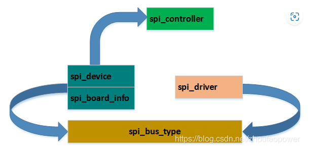

```c
struct bus_type spi_bus_type = {
	.name		= "spi",
	.dev_groups	= spi_dev_groups,
	.match		= spi_match_device,
	.uevent		= spi_uevent,
};
```
```c
struct spi_master *spi_alloc_master(struct device *dev, unsigned size)
int spi_register_master(struct spi_master *master)//将spi_master注册到内核中
void spi_unregister_master(struct spi_master *master)//spi控制器注销流程
```
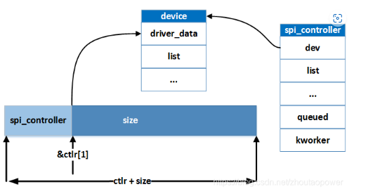

```c
static int s3c64xx_spi_probe(struct platform_device *pdev)
{
.......
    struct s3c64xx_spi_driver_data *sdd;
    struct spi_master *master;
 
    master = spi_alloc_master(&pdev->dev,
				sizeof(struct s3c64xx_spi_driver_data));
    platform_set_drvdata(pdev, master);
 
    sdd = spi_master_get_devdata(master);
.......
}

芯片厂商通过 spi_alloc_master 分配的多余的内容，全部给了他自己定义的这个 s3c64xx_spi_driver_data 结构，并通过：spi_master_get_devdata -> spi_controller_get_devdata -> dev_get_drvdata 来获得了在 spi_alloc_master 期间的这个自定义的数据结构
```

```c
//注册spi_driver
#define spi_register_driver(driver) \
	__spi_register_driver(THIS_MODULE, driver)

//注销spi_driver
static inline void spi_unregister_driver(struct spi_driver *sdrv);
```
```c
//注册spi_device
struct spi_device *spi_new_device(struct spi_master *master,
				  struct spi_board_info *chip);
//注销spi_device
void spi_unregister_device(struct spi_device *spi);

```
```c
//用于初始化spi_message结构
static inline void spi_message_init(struct spi_message *m);

//把一个spi_transfer加入到一个spi_message中
static inline void spi_message_add_tail(struct spi_transfer *t, struct spi_message *m);

//移除一个spi_transfer
static inline void spi_transfer_del(struct spi_transfer *t);

//初始化一个spi_message并添加数个spi_transfer
static inline void spi_message_init_with_transfers(struct spi_message *m,struct spi_transfer *xfers, unsigned int num_xfers);

//分配一个自带数个spi_transfer结构体的spi_message
static inline struct spi_message *spi_message_alloc(unsigned ntrans, gfp_t flags);

//发起一个spi_message，异步版本
int spi_async(struct spi_device *spi, struct spi_message *message);

//发起一个spi_message，同步版本
int spi_sync(struct spi_device *spi, struct spi_message *message);
首先，transfer_list链表字段用于把该transfer挂在一个spi_message结构中，tx_buf和rx_buf提供了非dma模式下的数据缓冲区地址，len则是需要传输数据的长度，tx_dma和rx_dma则给出了dma模式下的缓冲区地址。原则来讲，spi_transfer才是传输的最小单位，之所以又引进了spi_message进行打包，我觉得原因是：有时候希望往spi设备的多个不连续的地址（或寄存器）一次性写入，如果没有spi_message进行把这样的多个spi_transfer打包，因为通常真正的数据传送工作是在另一个内核线程（工作队列）中完成的，不打包的后果就是会造成更多的进程切换，效率降低，延迟增加，尤其对于多个不连续地址的小规模数据传送而言就更为明显

同步方式简单易用，很适合处理那些少量数据的单次传输。但是对于数据量大、次数多的传输来说，异步方式就显得更加合适。

```
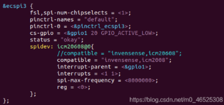

```c
/* 传统匹配方式ID列表 */
static const struct spi_device_id icm20608_id[] = {
	{"alientek,icm20608", 0},  
	{}
};

/* 设备树匹配列表 */
static const struct of_device_id icm20608_of_match[] = {
	{ .compatible = "alientek,icm20608" },
	{ /* Sentinel */ }
};

/* SPI驱动结构体 */	
static struct spi_driver icm20608_driver = {
	.probe = icm20608_probe,
	.remove = icm20608_remove,
	.driver = {
			.owner = THIS_MODULE,
		   	.name = "icm20608",
		   	.of_match_table = icm20608_of_match, 
		   },
	.id_table = icm20608_id,
};
		   
/*
 * @description	: 驱动入口函数
 * @param 		: 无
 * @return 		: 无
 */
static int __init icm20608_init(void)
{
	return spi_register_driver(&icm20608_driver);
}

/*
 * @description	: 驱动出口函数
 * @param 		: 无
 * @return 		: 无
 */
static void __exit icm20608_exit(void)
{
	spi_unregister_driver(&icm20608_driver);
}
```


spi demo
```c
/*
 * @description	: 从icm20608读取多个寄存器数据
 * @param - dev:  icm20608设备
 * @param - reg:  要读取的寄存器首地址
 * @param - val:  读取到的数据
 * @param - len:  要读取的数据长度
 * @return 		: 操作结果
 */
static int icm20608_read_regs(struct icm20608_dev *dev, u8 reg, void *buf, int len)
{
	int ret;
	unsigned char txdata[len];
	struct spi_message m;
	struct spi_transfer *t;
	struct spi_device *spi = (struct spi_device *)dev->private_data;
...
	spi_message_init(&m);		/* 初始化spi_message */
	spi_message_add_tail(t, &m);/* 将spi_transfer添加到spi_message队列 */
	ret = spi_sync(spi, &m);	/* 同步发送 */
}
```


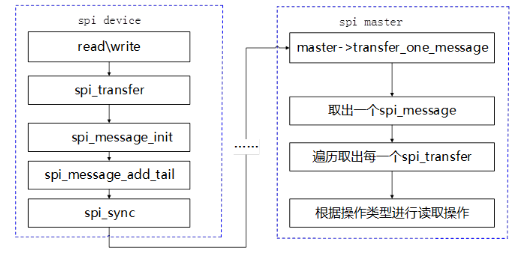
demo中主要函数原型
```c
static inline void spi_message_init(struct spi_message *m)
{
	memset(m, 0, sizeof *m);
	spi_message_init_no_memset(m);//将M的transfers，resources初始化为链表头
}

//将transfers添加到spi_message transfers的队列
static inline void spi_message_add_tail(struct spi_transfer *t, struct spi_message *m)
{
	list_add_tail(&t->transfer_list, &m->transfers);
}

int spi_sync(struct spi_device *spi, struct spi_message *message)
{
...	
	ret = __spi_sync(spi, message);
...
}


static int __spi_sync(struct spi_device *spi, struct spi_message *message)
{
...
struct spi_master *master = spi->master;//获取设备中的spi_master
__spi_pump_messages(master, false);
...
}
```

```c
static void __spi_pump_messages(struct spi_master *master, bool in_kthread)
{
    ...
    	ret = master->transfer_one_message(master, master->cur_msg);
    ...
}
```

实例化函数
```c
static int spi_transfer_one_message(struct spi_master *master,
				    struct spi_message *msg)
{
...

	ret = master->transfer_one(master, msg->spi, xfer);
...
}

master->transfer_one()中的transfer_one是驱动自己实现的

举例：spi-rspi.c
//
static int rspi_transfer_one(struct spi_master *master, struct spi_device *spi,struct spi_transfer *xfer)
{
	struct rspi_data *rspi = spi_master_get_devdata(master);
	u8 spcr;

	spcr = rspi_read8(rspi, RSPI_SPCR);
	if (xfer->rx_buf) {
		rspi_receive_init(rspi);
		spcr &= ~SPCR_TXMD;
	} else {
		spcr |= SPCR_TXMD;
	}
	rspi_write8(rspi, spcr, RSPI_SPCR);

	return rspi_common_transfer(rspi, xfer);
}

static const struct spi_ops rspi_ops = {
..
	.transfer_one =		rspi_transfer_one,
...
};

static const struct platform_device_id spi_driver_ids[] = {
	{ "rspi",	(kernel_ulong_t)&rspi_ops },
...
};
static struct platform_driver rspi_driver = {
...
	.id_table =	spi_driver_ids,
...
};
```


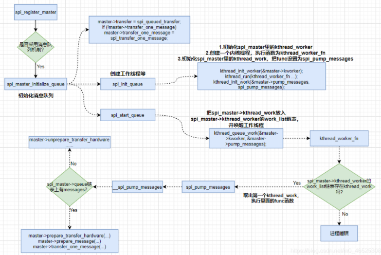

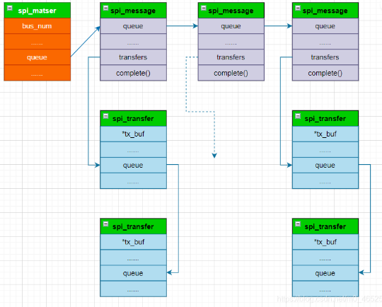

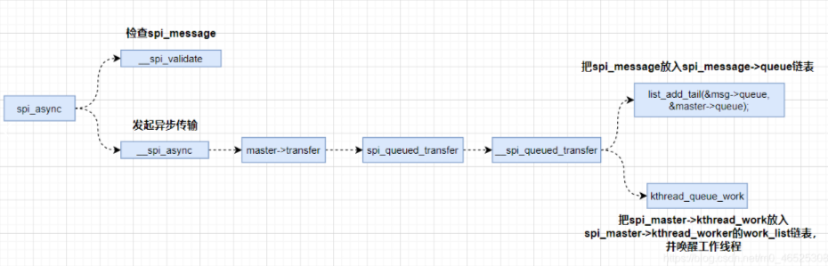


# spi框架总结

**1. 首先是内核创建一个SPI的总线bus
2. spi_register_driver(&spi_driver)//将spi_driver注册到SPI总线上
3. spi_driver.probe()函数中,创建spi device ，分配一个spi master并挂载到spi_master_list上**
```c
spi_driver.probe()
{
    struct s3c64xx_spi_driver_data *sdd;//s3c64xx_spi_driver_data包含spi_device信息
sdd = spi_master_get_devdata(master);//将spi device设置为master的data
sdd->port_conf = s3c64xx_spi_get_port_config(pdev);
sdd->master = master;
sdd->cntrlr_info = sci;
sdd->pdev = pdev;
sdd->sfr_start = mem_res->star


struct spi_master* master
master = spi_alloc_master(&pdev->dev,sizeof(struct s3c64xx_spi_driver_data));//分配一个spi_master，
master->setup = s3c64xx_spi_setup;
master->cleanup = s3c64xx_spi_cleanup;
master->prepare_transfer_hardware = s3c64xx_spi_prepare_transfer;
master->prepare_message = s3c64xx_spi_prepare_message;
master->transfer_one = s3c64xx_spi_transfer_one;
master->unprepare_transfer_hardware = s3c64xx_spi_unprepare_transfer;
devm_spi_register_master(&pdev->dev, master);//spi master挂载到spi_master_list上,并将设备添加到SPI总线上
 ->devm_spi_register_master
  ->spi_register_master
   ->device_add();
    ->bus_add_device(dev);
}

```
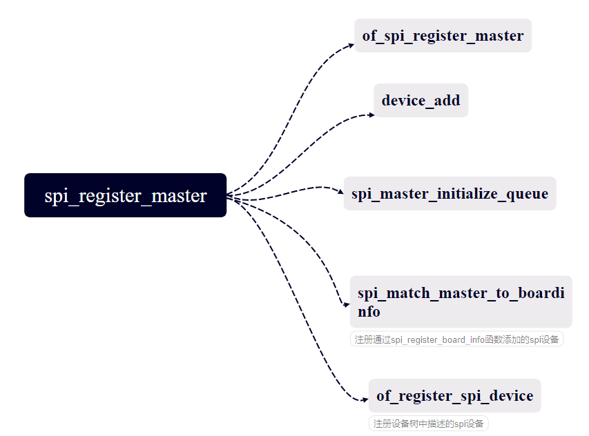
4. 设备是在设备树上，通过 of_match_ptr 中的 compatible 匹配值进行match挂载
5. 驱动读写的时候通过 spi_sync同步方式 或者spi_async异步方式实现
   


