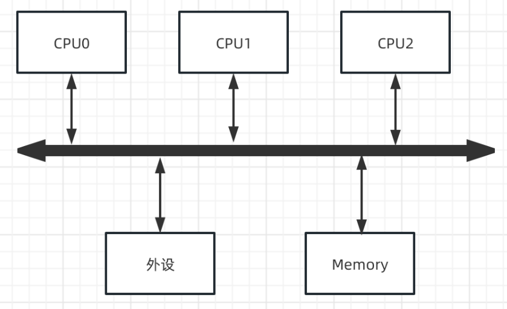
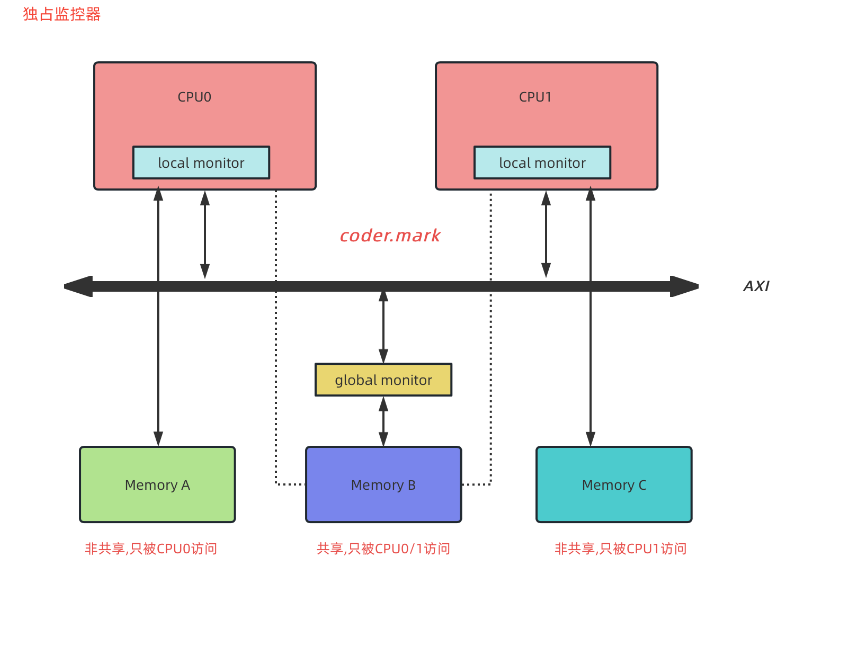
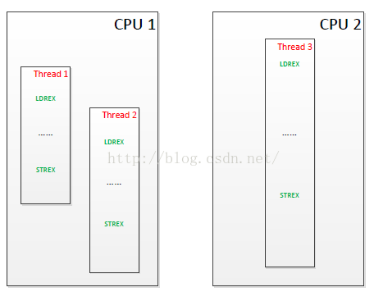

# 互斥
## 1简介互斥
什么是并发？
多个执行单元（进程、线程、中断）同时对一个共享资源进行访问；此处的共享资源可以是外设、内存或者软件层面的全局变量静态变量等；只要并发的多个执行单元存在对共享资源的访问，竞态就有可能发生。

什么是竞态？
多个执行单元访问（修改）共享单元势必会造成逻辑上的不一致，导致程序异常或者崩溃（Crash）。

在SMP多核系统中多个CPU都可以对外设或者内存进行访问，所以并发的情景更加频繁

## 2互斥原理LDREX和STREX
首先介绍一下基本的指令LDR，STR
```
LDR R0, [R1] ；将存储器地址为R1的字数据读入寄存器R0。
str r1, [r0] ；将r1寄存器的值，传送到地址值为r0的（存储器）内存中
```
```
LDREX R1, [R0] 码片段从R0寄存器表示的地址中读取一个字，存放在R1寄存器中，并且更新独占监控器状态为独占状态。
STREX指令存储一个字到内存中，但是这个存储指令是有条件的；如果独占监控器允许这个存储操作，那么对应的内存地址就会更新，并且将返回值0保存在目标寄存器中，代表此次操作成功；如果独占监控器不允许，那么就不会更新独占监控器，并且将返回值1保存在目标寄存器中，代表此次操作失败。
>https://developer.arm.com/documentation/dht0008/a/arm-synchronization-primitives/exclusive-accesses/ldrex-and-strex?lang=en
```

在ARM系统中，内存有两种不同且对立的属性，即共享（Shareable）和非共享（Non-shareable）。
1. 共享意味着该段内存可以被系统中不同处理器访问到，这些处理器可以是同构的也可以是异构的。
2. 非共享，则相反，意味着该段内存只能被系统中的一个处理器所访问到，对别的处理器来说不可见。
为了实现独占访问，ARM系统中还特别提供了所谓独占监视器（Exclusive Monitor）的东西，其结构大致如下

如果要对非共享内存区中的值进行独占访问，只需要涉及本处理器内部的本地监视器就可以了；
而如果要对共享内存区中的内存进行独占访问，除了要涉及到本处理器内部的本地监视器外，由于该内存区域可以被系统中所有处理器访问到，因此还必须要由全局监视器来协调。
对于本地监视器来说，它只标记了本处理器对某段内存的独占访问，在调用LDREX指令时设置独占访问标志，在调用STREX指令时清除独占访问标志。
而对于全局监视器来说，它可以标记每个处理器对某段内存的独占访问。也就是说，当一个处理器调用LDREX访问某段共享内存时，全局监视器只会设置针对该处理器的独占访问标记，不会影响到其它的处理器。当在以下两种情况下，会清除某个处理器的独占访问标记：
- 当该处理器调用LDREX指令，申请独占访问另一段内存时；
- 当别的处理器成功更新了该段独占访问内存值时。

为了更加清楚的说明，我们可以举一个例子。假设系统中有两个处理器内核，而一个程序由三个线程组成，其中两个线程被分配到了第一个处理器上，另外一个线程被分配到了第二个处理器上。且他们的执行序列如下

伪代码：
```c
1. cpu2:thread3 LDREX lock某段共享内存区域 全局监视器=1，本地监视器=1
2. cpu1:thread1 LDREX lock某段共享内存区域 全局监视器=1，本地监视器=1
3. cpu1:thread2 LDREX lock某段共享内存区域 全局监视器=1，本地监视器=1
4. cpu1:thread1 STREX if(全局监视器==1&&本地监视器==1)
{
    update 共享内存区域;
    全局监视器=0，本地监视器=0；
}
else
{
    update failed
}
所以cpu1:thread1 STREX更新成功
5. cpu2:thread3 STREX if(全局监视器==1&&本地监视器==1)
{
    update 共享内存区域;
}
else
{
    update failed
}
因为第四步已经将全局和本地监视器标记清空，所以cpu2:thread3 STREX执行失败
6. cpu1:thread2 STREX if(全局监视器==1&&本地监视器==1)
{
    update 共享内存区域;
}
else
{
    update failed
}
因为第四步已经将全局和本地监视器标记清空，所以cpu1:thread2 STREX执行失败
```

时间|进程1|进程2
--|--|--
T1|LDREX| 
T2|...| LDREX
T3|SRTEX|...
T4| |10|SRTEX
1. T1时刻进程1调用LDREX访问Memory A，此时本地监控器标记为已独占；
2. T2时刻进程2也调用LDREX访问Memory A，此时也会标记本地监控器为已独占；
3. T3时刻进程1调用STREX，此时由于本地监控器是独占状态，所以进程1的STREX操作成功同时清除本地独占器的独占状态
4. T4时刻进程2调用STREX，但是此时本地独占器为Open状态，故此处存储操作不成功；所以进程2必须重新通过LDREX指令去获取内存值去判断。

时间|进CPU0 threadX|CPU1 threadY
--|--|--
T1|LDREX| 
T2|...| LDREX
T3|SRTEX|...
T4| |10|SRTEX
1. T1时刻CPU0进程X调用LDREX访问Memory B，此时本地监控器和全局监控器标记为已独占；
2. T2时刻CPU1进程Y也调用LDREX访问Memory B，此时也会标记本地监控器和全局监控器为已独占；
3. T3时刻CPU0进程X调用STREX对Memory B进行存储操作，此时由于本地监控器和全局监控器是独占状态，所以CPU0进程X的STREX操作成功同时清除本地独占器和全解监控器的独占状态；
4. T4时刻CPU1进程Y调用STREX，此时本地独占器为独占状态但是全局监控器为open状态，故此处存储操作不成功；所以进程Y必须重新通过LDREX指令去获取内存值去判断。

**总结来说：大家都能开门（设置监视器标记），但是谁先把东西放进门后（更新这块内存）就关上门（清空监视器标记），再想放东西需要重新开门，**

参考链接:
>https://blog.csdn.net/Roland_Sun/article/details/47670099?spm=1001.2101.3001.6650.2&utm_medium=distribute.pc_relevant.none-task-blog-2%7Edefault%7ECTRLIST%7ERate-2-47670099-blog-8212123.235%5Ev38%5Epc_relevant_sort_base1&depth_1-utm_source=distribute.pc_relevant.none-task-blog-2%7Edefault%7ECTRLIST%7ERate-2-47670099-blog-8212123.235%5Ev38%5Epc_relevant_sort_base1&utm_relevant_index=5
>https://blog.csdn.net/tianizimark/article/details/129215376
>https://blog.csdn.net/tianizimark/article/details/129215376


