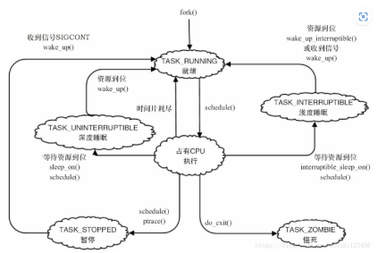

# 阻塞非阻塞IO
## linux系统状态
Linux系统有6种状态

定义等待队列头部
```c
1. 定义等待队列头部
wait_queue_head_t my_queue;
2. 初始化等待队列头部
init_waitqueue_head(&my_queue);

DECLEAR_WAIT_QUEUE_HEAD(name);
3. 定义等待队列元素
DECLEAR_WAITQUEUE(name,tsk);
4. 添加、移除等待队列
void add_wait_queue(wait_queue_head_t*q,wait_queue_t *wait);
void remove_wait_queue(wait_queue_head_t*q,wait_queue_t *wait);
5. 等待事件
wait_event(queue,condition);//不能被信号打断
wait_event_interruptible(queue,condition);//能被信号打断，
wait_event_timeout(queue,condition ,timeout);
wait_event_interruptible_timeout(queue, condition, timeout)
* 函数作用：~睡眠~,直到condition为真，或timeout超时；时间单位时jiffy
* @wq: 要等待的等待队列
* @condition: 等待事件发生的条件（一个C表达式 ）

6. 唤醒队列
void wake_up(wait_queue_head_t* queue);
void wake_up_interruptible(wait_queue_head_t* queue);

7. 在等待队列上睡眠
sleep_on(wait_queue_head_t* queue);//将队列状态设置为深度睡眠
interruptible_sleep_on(wait_queue_head_t* queue);//将队列状态设置为浅度睡眠
```
```c
__set_current_state(TASK_INTERRUPTIBLE);//标记当前状态为浅睡眠
schedule();//进行线程调度，真正进入浅睡眠

```
## 轮询操作

select()系统调用
```c
int select(int numfds,fd_set *readfds,fd_set *writefds,fd_set *exceptfds,struct timeval *timeout);//读、写、异常处理的文件描述符

FD_ZERO(fd_set *set)//清除一个描述符
FD_SET(fd_set *set)//将一个描述符添加到文件描述符集合
FD_CLR(int fd,fd_set *set)//将一个文件描述符从文件描述符集合中清楚
FD_ISSET(int fd,fd_set *set)//判断文件描述符是否置为

```

## 应用程序中的轮询
epoll适用于多文件监听
```c
epoll 用户空间编程接口
int epoll_create(int size);
创建好epoll句柄 ，它本身也会占用一个fd,用完必须关闭
```
## 设备驱动中的轮询
poll函数原型
```c
unsigned int (*poll)(struct file* filp,struct poll_table* wait);
filp-> file结构体指针
wait-> 轮询表指针
1. 对可能引起设备文件状态变化的等待队列调用poll_wait()函数，将对应的等待队列头部添加到poll_table
2. 返回表示是否能对设备进行无阻塞读写的掩码
用于向poll_table注册等待队列的关键poll_wait()函数


/* 
 * structures and helpers for f_op->poll implementations
 */
typedef void (*poll_queue_proc)(struct file *, wait_queue_head_t *, struct poll_table_struct *);

/*
 * Do not touch the structure directly, use the access functions
 * poll_does_not_wait() and poll_requested_events() instead.
 */
typedef struct poll_table_struct {
	poll_queue_proc _qproc;
	__poll_t _key;
} poll_table;

static inline void poll_wait(struct file * filp, wait_queue_head_t * wait_address, poll_table *p)
{
	if (p && p->_qproc && wait_address)
		p->_qproc(filp, wait_address, p);
}
poll_wait()函数的作用是将进程添加到wait参数指定的等待列表（poll_table）中，实际作用是让唤醒参数queue对应的等待队列可以唤醒因select()而睡眠的进程
```
掩码	|说明
--|--
POLLIN|	普通或优先级带数据可读
POLLRDNORM	|普通数据可读
POLLRDBAND|	优先级带数据可读
POLLPRI|	高优先级数据可读
POLLOUT|	普通数据可写
POLLWRNORM|	普通数据可写
POLLWRBAND	|优先级带数据可写
POLLERR	|发生错误
POLLHUP	|发生挂起
POLLNVAL	|描述字不是一个打开的文件


