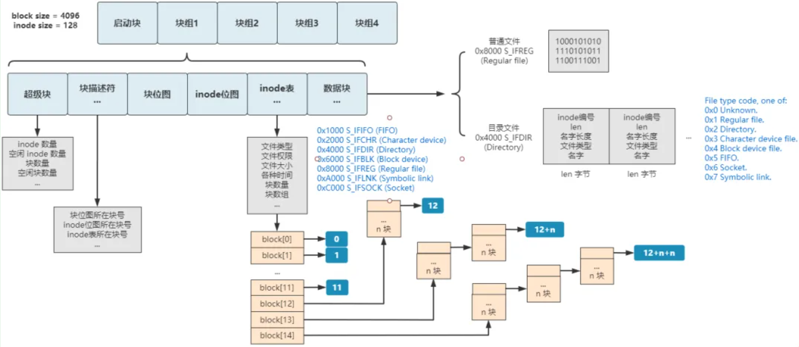
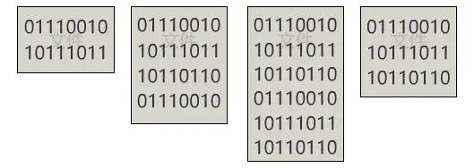
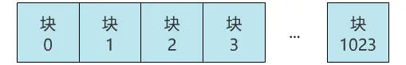
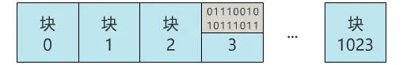
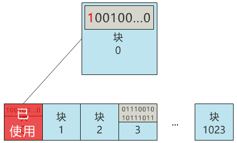
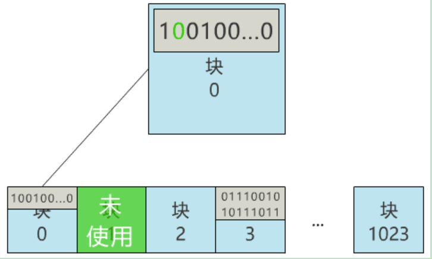
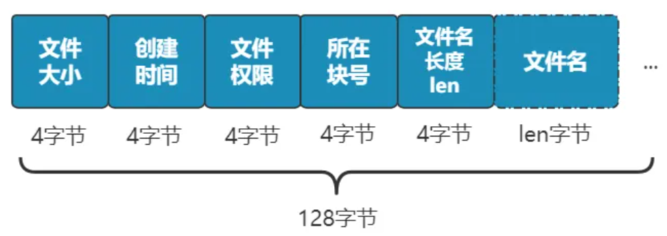
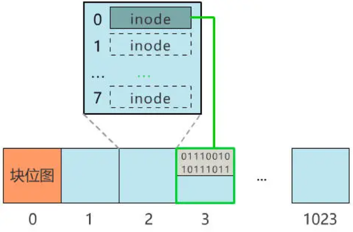
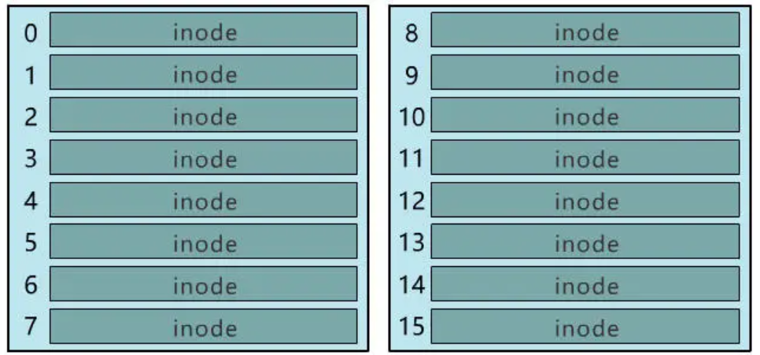
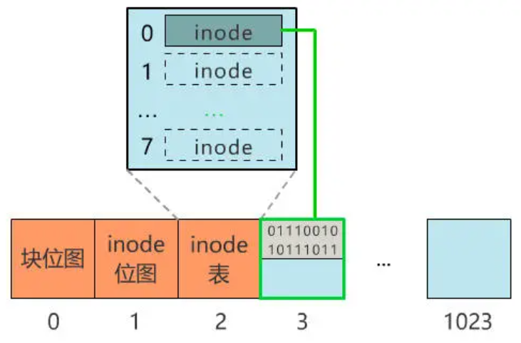

# 文件系统


由图可知，文件系统的重要组成部分是
1. 启动块
2. 超级快
3. 快描述符
4. 块位图
## 文件系统的存储原理
这是要存储的文件

对于硬盘来说文件是这样的

如何将这些文件存储在磁盘当中，并且能更方便的读写文件是我们今天要讨论的问题

### 2.块位图
假如一个块是2个扇区，硬盘大小只有1M，那么硬盘就可以分为1024个块

我们就可以任意选一个块存储我们的文件

但是如果我们需要存储多个文件的话，我们需要知道那个块可用或者不可用
**块位图**：记录块的使用情况。这里我们使用0号块记录
 


### 3.inode
现在我们需要查找刚才存储的文件，需要怎么办呢，用刚才记录的块号，这过两天也会忘掉，而且今天存块3，明天存块4，也容易记忆混乱。所以我们最好通过文件名字查找文件
同时也可以记录更多的信息比如文件大小、文件创建时间、文件权限等。


我们每存储一个文件，就同时占用一个 inode 去存储这些元信息，所在块号指向存储文件的块

一个 inode 存一个文件，占用128个字节，一个块是1024字节，所以一个块能存储8个inode,文件越多需要的inode越多


同块管理一样，我们也需要创建inode位图，去管理inode


### 4.间接索引


目录文件，linux里面目录也是一种文件
```c
static int ext2_create (struct inode * dir, struct dentry * dentry, umode_t mode, bool excl)// 创建普通的文件

#define S_IFREG  0100000	/* regular */
#define S_IFBLK  0060000	/* block special */
#define S_IFDIR  0040000	/* directory */
#define S_IFCHR  0020000	/* character special */
#define S_IFIFO  0010000	/* fifo */
static int ext2_mkdir(struct inode * dir, struct dentry * dentry, umode_t mode)//创建目录文件

```


### 块组描述符表（GDT，Group Descriptor Table）

- 由很多块组描述符组成，整个分区分成多少个块组就对应有多少个块组描述符。每个块组描述符（Group Descriptor）存储一个块组的描述信息，例如在这个块组中从哪里开始是inode表，从哪里开始是数据块，空闲的inode和数据块还有多少个等等。和超级块类似，块组描述符表在每个块组的开头也都有一份拷贝，这些信息是非常重要的，一旦超级块意外损坏就会丢失整个分区的数据，一旦块组描述符意外损坏就会丢失整个块组的数据，因此它们都有多份拷贝。通常内核只用到第0个块组中的拷贝，当执行e2fsck检查文件系统一致性时，第0个块组中的超级块和块组描述符表就会拷贝到其它块组，这样当第0个块组的开头意外损坏时就可以用其它拷贝来恢复，从而减少损失。
- 启动块，超级块和块组描述符都占 1KB，但是即使启动快和超级块填不满所在块，块组描述符也不使用该块。

```C
. 如果块大小为 1KB，那么显然第 0 块是启动快，第 1 块是超级块，块组描述符在第 2 块，地址为 2 * 0x400 = 0x800
· 如果块大小为 2 KB，那么启动快和超级块均在第 0 块，块组描述符在第 1 块，地址为 1 * 0x800 = 0x800
· 如果块大小为 4 KB，启动快和超级块在第 0 块，但是虽然第 0 块仍然有空间，块组描述符也不在此块，而在下一块，地址为 1 * 0x1000 = 0x1000
```

## ext2文件系统
/*
 * By the time this is called, we already have created
 * the directory cache entry for the new file, but it
 * is so far negative - it has no inode.
 *
 * If the create succeeds, we fill in the inode information
 * with d_instantiate(). 
 */
  static int ext2_create (struct inode * dir, struct dentry * dentry, umode_t mode, bool excl)
  {
	struct inode *inode;

	dquot_initialize(dir);

	inode = ext2_new_inode(dir, mode, &dentry->d_name);
	if (IS_ERR(inode))
		return PTR_ERR(inode);

	inode->i_op = &ext2_file_inode_operations;
	if (test_opt(inode->i_sb, NOBH)) {
		inode->i_mapping->a_ops = &ext2_nobh_aops;
		inode->i_fop = &ext2_file_operations;
	} else {
		inode->i_mapping->a_ops = &ext2_aops;
		inode->i_fop = &ext2_file_operations;
	}
	mark_inode_dirty(inode);
	return ext2_add_nondir(dentry, inode);
  }

static int ext2_tmpfile(struct inode *dir, struct dentry *dentry, umode_t mode)
{
	struct inode *inode = ext2_new_inode(dir, mode, NULL);
	if (IS_ERR(inode))
		return PTR_ERR(inode);

	inode->i_op = &ext2_file_inode_operations;
	if (test_opt(inode->i_sb, NOBH)) {
		inode->i_mapping->a_ops = &ext2_nobh_aops;
		inode->i_fop = &ext2_file_operations;
	} else {
		inode->i_mapping->a_ops = &ext2_aops;
		inode->i_fop = &ext2_file_operations;
	}
	mark_inode_dirty(inode);
	d_tmpfile(dentry, inode);
	unlock_new_inode(inode);
	return 0;
}


## 文件系统的种类
- 磁盘的文件系统，它是直接把数据存储在磁盘中，比如 Ext 2/3/4、XFS 等都是这类文件系统。
- 内存的文件系统，这类文件系统的数据不是存储在硬盘的，而是占用内存空间，我们经常用到的 /proc 和 /sys 文件系统都属于这一类，读写这类文件，实际上是读写内核中相关的数据数据。
- 网络的文件系统，用来访问其他计算机主机数据的文件系统，比如 NFS、SMB 等等。
  

文件系统首先要先挂载到某个目录才可以正常使用，比如 Linux 系统在启动时，会把文件系统挂载到根目录。


# ext2文件系统

```
struct ext2_inode { 

 __u16 i_mode; 

/* 文件类型和访问权限 */ 

 __u16 i_uid; /* 文件拥有者标识号*/ 

 __u32 i_size; /* 以字节计的文件大小 */ 

 __u32 i_atime; /* 文件的最后一次访问时间 */ 

 __u32 i_ctime; /* 该节点最后被修改时间 */ 

 __u32 i_mtime; /* 文件内容的最后修改时间 */ 

 __u32 i_dtime; /* 文件删除时间 */ 

 __u16 i_gid; /* 文件的用户组标志符 */ 

 __u16 i_links_count; /* 文件的硬链接计数 */ 

 __u32 i_blocks; /* 文件所占块数（每块以 512 字节计）*/ 

 __u32 i_flags; /* 打开文件的方式 */ 

 union /*特定操作系统的信息*/ 

 __u32 i_block[Ext2_N_BLOCKS]; /* 指向数据块的指针数组 */ 

 __u32 i_version; /* 文件的版本号（用于 NFS） */ 

 __u32 i_file_acl; /*文件访问控制表（已不再使用） */ 

 __u32 i_dir_acl; /*目录访问控制表（已不再使用）*/ 

 __u8 l_i_frag; /* 每块中的片数 */ 

 __u32 i_faddr; /* 片的地址 */ 

 union /*特定操作系统信息*/ 

} 
```

Ext2 默认的物理块大小为 1KB，块地址占 4 个字节（32 位），

所以每个物理块可以存储 256 个地址。这样，文件大小最大可达 12KB+256KB+ 64MB+16GB

```
struct ext2_inode_info 
{ 
 __u32 i_data[15]; /*数据块指针数组*/ 
 __u32 i_flags; /*打开文件的方式*/ 
 __u32 i_faddr; /*片的地址*/ 
 __u8 i_frag_no; /*如果用到片，则是第一个片号*/ 
 __u8 i_frag_size; /*片大小*/ 
 __u16 i_osync; /*同步*/ 
 __u32 i_file_acl; /*文件访问控制链表*/ 
 __u32 i_dir_acl; /*目录访问控制链表*/ 
 __u32 i_dtime; /*文件的删除时间*/ 
 __u32 i_block_group; /*索引节点所在的块组号*/ 
/******以下四个域是用于操作预分配块的*************/ 
 __u32 i_next_alloc_block; 
 __u32 i_next_alloc_goal; 
 __u32 i_prealloc_block; 
 __u32 i_prealloc_count; 
 __u32 i_dir_start_lookup 
 int i_new_inode:1 /* Is a freshly allocated inode */ 
};
```

```
struct ext2_group_desc 
{ 
 __u32 bg_block_bitmap; /*组中块位图所在的块号 */ 
 __u32 bg_inode_bitmap; /*组中索引节点位图所在块的块号 */ 
 __u32 bg_inode_table; /*组中索引节点表的首块号 */ 
 __u16 bg_free_blocks_count; /*组中空闲块数 */ 
 __u16 bg_free_inodes_count; /* 组中空闲索引节点数 */ 
 __u16 bg_used_dirs_count; /*组中分配给目录的节点数 */ 
 __u16 bg_pad; /*填充，对齐到字*/ 
 __u32［3］ bg_reserved; /*用 NULL 填充 12 个字节*/ 
}
```

### ext2目录文件的操作

const struct inode_operations ext2_dir_inode_operations = {
	.create		= ext2_create,
	.lookup		= ext2_lookup,
	.link		= ext2_link,
	.unlink		= ext2_unlink,
	.symlink	= ext2_symlink,
	.mkdir		= ext2_mkdir,
	.rmdir		= ext2_rmdir,
	.mknod		= ext2_mknod,
	.rename		= ext2_rename,
#ifdef CONFIG_EXT2_FS_XATTR
	.setxattr	= generic_setxattr,
	.getxattr	= generic_getxattr,
	.listxattr	= ext2_listxattr,
	.removexattr	= generic_removexattr,
#endif
	.setattr	= ext2_setattr,
	.get_acl	= ext2_get_acl,
	.set_acl	= ext2_set_acl,
	.tmpfile	= ext2_tmpfile,
};

### ext2普通文件的操作

const struct file_operations ext2_file_operations = {
	.llseek		= generic_file_llseek,
	.read_iter	= generic_file_read_iter,
	.write_iter	= generic_file_write_iter,
	.unlocked_ioctl = ext2_ioctl,
#ifdef CONFIG_COMPAT
	.compat_ioctl	= ext2_compat_ioctl,
#endif
	.mmap		= ext2_file_mmap,
	.open		= dquot_file_open,
	.release	= ext2_release_file,
	.fsync		= ext2_fsync,
	.splice_read	= generic_file_splice_read,
	.splice_write	= iter_file_splice_write,
};

### ext2文件inode的操作

const struct inode_operations ext2_file_inode_operations = {
#ifdef CONFIG_EXT2_FS_XATTR
	.setxattr	= generic_setxattr,
	.getxattr	= generic_getxattr,
	.listxattr	= ext2_listxattr,
	.removexattr	= generic_removexattr,
#endif
	.setattr	= ext2_setattr,
	.get_acl	= ext2_get_acl,
	.set_acl	= ext2_set_acl,
	.fiemap		= ext2_fiemap,
};

## 文件的操作

## 文件删除

关于文件的删除，我们分别介绍一下 **普通文件** 和 **目录文件** 的删除操作。

### 普通文件删除

对于普通文件删除，其大致可分为以下几个步骤：

- step 1：找到目标文件 Inode 和 Data Block
- step 2：将 Inode Table 中对应 Inode 中的 Data Block 指针删除（位于 `i_blocks[]` 中）
- step 3：在 Inode Bitmap 中，将对应 Inode 标记为未使用
- step 4：找到目标文件的父级目录的 Data Block，将与目标文件匹配的目录项删除。具体做法是：
  - 修改对应目录项的 inode 序号设置为 0
  - 修改前一个目录项的 `rec_len`，使文件系统在扫描时能够跳过被删除的目录项
- step 5：在 Block Bitmap 中，将对应的 Block 标记为未使用

### 目录文件删除

对于目录文件删除，其大致可分为以下几个步骤：

- step 1：找到目录及其目录下的所有文件、子目录、子文件的 Inode 和 Data Block
- step 2：在 Inode Bitmap 中，将所有对应的 Inode 标记为未使用
- step 3：在 Block Bitmap 中，将所有对应的 Block 标记为未使用
- step 4：找到目标目录的父级目录的 Data Block，将与目标目录匹配的目录项删除。

相比而言，目录文件删除时，需要将子目录和子文件全部删除。

## 文件重命名

关于文件的重命名，我们分别介绍一下 **同目录内** 和 **非同目录内** 的重命名操作。

### 同目录内重命名

同目录内重命名，其仅仅是找到目录的 Data Block 中对应的目录项，并将原始文件名修改为目标文件名。

### 非同目录内重命名

非同目录内重命名，本质上就是文件移动操作。具体细节，见下一节。

## 文件移动

文件移动，可分两种情况讨论，分别是 **目标路径下有同名文件** 和 **目标路径下无同名文件**。

假设，我们要将执行 `mv /origin/file /target/file` 操作。

如果目标路径下有同名文件，文件移动操作可以分为两部分：

- 找到 `/origin` 目录的 Data Block，将 `file` 文件的目录项删除。
- 找到 `/target` 目录的 Data Block，将同名文件 `file` 的目录项的 inode 序号修改为新的 inode 序号。

如果目标路径下无同名文件，文件移动操作也可以分为两部分：

- 找到 `/origin` 目录的 Data Block，将 `file` 文件的目录项删除。
- 找到 `/target` 目录的 Data Block，新增一个 `file` 文件的目录项。

文件移动本质上就是修改了文件的目录项中 Inode 的指针或新增目录项，因此速度非常快。
