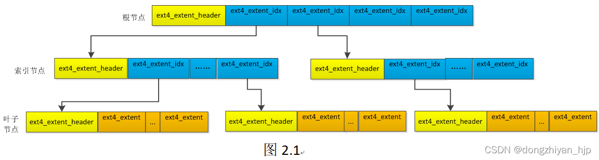
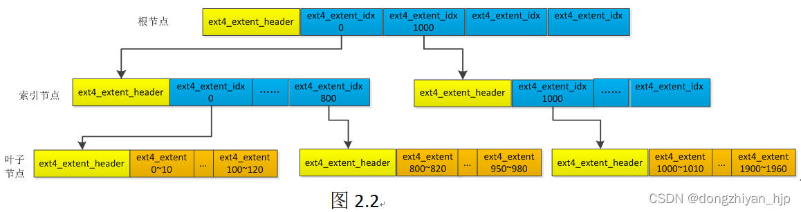

```
root@alpha:/# dumpe2fs /dev/part/app
dumpe2fs 1.47.1 (20-May-2024)
Filesystem volume name:   <none>
Last mounted on:          <not available>
Filesystem UUID:          56b02888-5bab-4e7a-8524-cf3cfee95474
Filesystem magic number:  0xEF53
Filesystem revision #:    1 (dynamic)
Filesystem features:      dir_index filetype sparse_super
Filesystem flags:         unsigned_directory_hash
Default mount options:    (none)
Filesystem state:         not clean
Errors behavior:          Continue
Filesystem OS type:       Linux
Inode count:              16384
Block count:              65536
Reserved block count:     3276
Free blocks:              63448
Free inodes:              16373
First block:              1
Block size:               1024
Fragment size:            1024
Blocks per group:         8192
Fragments per group:      8192
Inodes per group:         2048
Inode blocks per group:   256
Filesystem created:       Thu Jan  1 00:11:23 1970
Last mount time:          n/a
Last write time:          Thu Jan  1 00:11:25 1970
Mount count:              1
Maximum mount count:      36
Last checked:             Thu Jan  1 00:11:23 1970
Check interval:           15552000 (6 months)
Next check after:         Tue Jun 30 00:11:23 1970
Reserved blocks uid:      0 (user root)
Reserved blocks gid:      0 (group root)
First inode:              11
Inode size:               128
Default directory hash:   half_md4
Directory Hash Seed:      9ae0f720-5926-48ec-9076-b5b390316c6f

```

```
Group 0: (Blocks 1-8192)
  Primary superblock at 1, Group descriptors at 2-2
  Block bitmap at 3 (+2)
  Inode bitmap at 4 (+3)
  Inode table at 5-260 (+4)
  7919 free blocks, 2036 free inodes, 2 directories
  Free blocks: 274-8192
  Free inodes: 13-2048
Group 1: (Blocks 8193-16384)
  Backup superblock at 8193, Group descriptors at 8194-8194
  Block bitmap at 8195 (+2)
  Inode bitmap at 8196 (+3)
  Inode table at 8197-8452 (+4)
  7932 free blocks, 2048 free inodes, 0 directories
  Free blocks: 8453-16384
  Free inodes: 2049-4096
Group 2: (Blocks 16385-24576)
  Block bitmap at 16385 (+0)
  Inode bitmap at 16386 (+1)
  Inode table at 16387-16642 (+2)
  7933 free blocks, 2047 free inodes, 1 directories
  Free blocks: 16643-19968, 19970-24576
  Free inodes: 4098-6144
Group 3: (Blocks 24577-32768)
  Backup superblock at 24577, Group descriptors at 24578-24578
  Block bitmap at 24579 (+2)
  Inode bitmap at 24580 (+3)
  Inode table at 24581-24836 (+4)
  7932 free blocks, 2048 free inodes, 0 directories
  Free blocks: 24837-32768
  Free inodes: 6145-8192

```


```
root@alpha:/nfs# hexdump -C bb.bin
00000000  ff ff ff ff ff ff ff ff  ff ff ff ff ff ff ff ff  |................|
*
00000020  ff ff 01 00 00 00 00 00  00 00 00 00 00 00 00 00  |................|
00000030  00 00 00 00 00 00 00 00  00 00 00 00 00 00 00 00  |................|
*
00000400

```

计算0x22=34 34*8+1=273,第一个组的freeblock是Free blocks: 274-8192是吻合的

## ext4 extent


```
/*
 * This is the extent on-disk structure.
 * It's used at the bottom of the tree.
 */
struct ext4_extent {
	__le32	ee_block;	/* first logical block extent covers */
	__le16	ee_len;		/* number of blocks covered by extent */
	__le16	ee_start_hi;	/* high 16 bits of physical block */
	__le32	ee_start_lo;	/* low 32 bits of physical block */
};

/*
 * This is index on-disk structure.
 * It's used at all the levels except the bottom.
 */
struct ext4_extent_idx {
	__le32	ei_block;	/* index covers logical blocks from 'block' */
	__le32	ei_leaf_lo;	/* pointer to the physical block of the next *
				 * level. leaf or next index could be there */
	__le16	ei_leaf_hi;	/* high 16 bits of physical block */
	__u16	ei_unused;
};

/* Each block (leaves and indexes), even inode-stored has header. */
struct ext4_extent_header {
	__le16	eh_magic;	/* probably will support different formats */
	__le16	eh_entries;	/* number of valid entries */
	__le16	eh_max;		/* capacity of store in entries */
	__le16	eh_depth;	/* has tree real underlying blocks? */
	__le32	eh_generation;	/* generation of the tree */
};
```

 如果文件小于512M 则 extent header 的deep值为0 ，4个条目全部为数据项。 关于为什么是512M 因为数据项条目中的 __le16 ee_len 最大管理32768个块 也就是一个组块大小128M 4个就是512M

如果块大小≤ 4KB ，则ee_len = 32768 (#define EXT_INIT_MAX_LEN	(1UL << 15))

32768 *4kb=131072=131.072Mb  实际是128MB

eh_depth


假设我们想知道文件逻辑地址0映射的物理块地址是什么？首先找到根节点的第一个ext4_extent_idx，它的起始逻辑块号是0。然后找到它指向的索引节点，再找到该索引节点的第一个ext4_extent_idx，它的起始逻辑块号也是0。继续，找到当前索引节点第一个ext4_extent_idx指向的叶子节点。因为该叶子节点的第一个ext4_extent对应的逻辑块地址范围是0~10，我们要查找逻辑块地址0正好在它的逻辑块地址范围内。好的，每一个有效的ext4_extent数据结构都保存了其代表的逻辑块地址映射的物理块地址，理所应当，通过逻辑块地址范围0~10这个ext4_extent就可以直到逻辑块地址0映射的物理块地址。

```
open_filesys, open       Open a filesystem
close_filesys, close     Close the filesystem
freefrag, e2freefrag     Report free space fragmentation
feature, features        Set/print superblock features
dirty_filesys, dirty     Mark the filesystem as dirty
init_filesys             Initialize a filesystem (DESTROYS DATA)
show_super_stats, stats  Show superblock statistics
ncheck                   Do inode->name translation
icheck                   Do block->inode translation
change_root_directory, chroot
                         Change root directory
change_working_directory, cd
                         Change working directory
list_directory, ls       List directory
show_inode_info, stat    Show inode information
dump_extents, extents, ex
                         Dump extents information
blocks                   Dump blocks used by an inode
filefrag                 Report fragmentation information for an inode
link, ln                 Create directory link
unlink                   Delete a directory link
mkdir                    Create a directory
rmdir                    Remove a directory
rm                       Remove a file (unlink and kill_file, if appropriate)
kill_file                Deallocate an inode and its blocks
copy_inode               Copy the inode structure
clri                     Clear an inode's contents
freei                    Clear an inode's in-use flag
seti                     Set an inode's in-use flag
testi                    Test an inode's in-use flag
freeb                    Clear a block's in-use flag
setb                     Set a block's in-use flag
testb                    Test a block's in-use flag
modify_inode, mi         Modify an inode by structure
find_free_block, ffb     Find free block(s)
find_free_inode, ffi     Find free inode(s)
print_working_directory, pwd
                         Print current working directory
expand_dir, expand       Expand directory
mknod                    Create a special file
list_deleted_inodes, lsdel
                         List deleted inodes
undelete, undel          Undelete file
write                    Copy a file from your native filesystem
dump_inode, dump         Dump an inode out to a file
cat                      Dump an inode out to stdout
lcd                      Change the current directory on your native filesystem
rdump                    Recursively dump a directory to the native filesystem
set_super_value, ssv     Set superblock value
set_inode_field, sif     Set inode field
set_block_group, set_bg  Set block group descriptor field
logdump                  Dump the contents of the journal
htree_dump, htree        Dump a hash-indexed directory
dx_hash, hash            Calculate the directory hash of a filename
dirsearch                Search a directory for a particular filename
bmap                     Calculate the logical->physical block mapping for an inode
fallocate                Allocate uninitialized blocks to an inode
punch, truncate          Punch (or truncate) blocks from an inode by deallocating them
symlink                  Create a symbolic link
imap                     Calculate the location of an inode
dump_unused              Dump unused blocks
set_current_time         Set current time to use when setting filesystem fields
supported_features       Print features supported by this version of e2fsprogs
dump_mmp                 Dump MMP information
set_mmp_value, smmp      Set MMP value
extent_open, eo          Open inode for extent manipulation
zap_block, zap           Zap block: fill with 0, pattern, flip bits etc.
block_dump, bdump, bd    Dump contents of a block
ea_list                  List extended attributes of an inode
ea_get                   Get an extended attribute of an inode
ea_set                   Set an extended attribute of an inode
ea_rm                    Remove an extended attribute of an inode
list_quota, lq           List quota
get_quota, gq            Get quota
inode_dump, idump, id    Dump the inode structure in hex
journal_open, jo         Open the journal
journal_close, jc        Close the journal
journal_write, jw        Write a transaction to the journal
journal_run, jr          Recover the journal
help                     Display info on command or topic.
list_requests, lr, ?     List available commands.
quit, q                  Leave the subsystem.

```
```
重点用法
debugfs:  show_inode_info a.c
Inode: 12   Type: regular    Mode:  0644   Flags: 0x0
Generation: 1000834727    Version: 0x00000000
User:     0   Group:     0   Size: 0
File ACL: 0
Links: 1   Blockcount: 0
Fragment:  Address: 0    Number: 0    Size: 0
ctime: 0x00004e6c -- Thu Jan  1 05:34:36 1970
atime: 0x000050c5 -- Thu Jan  1 05:44:37 1970
mtime: 0x00004e6c -- Thu Jan  1 05:34:36 1970
BLOCKS:

debugfs:  ncheck -c 12
Inode   Pathname
12      //a.c

debugfs:  imap hql_txt
Inode 13 is part of block group 0
        located at block 6, offset 0x0200
```

