# uart驱动
**uart 调用流程提**
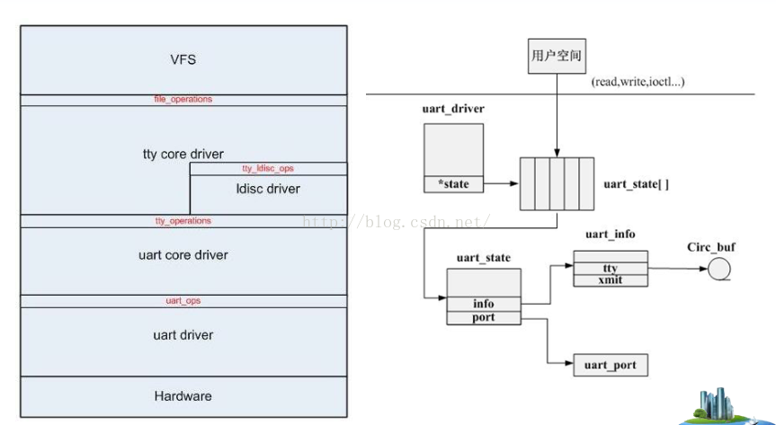

**uart重要结构体**
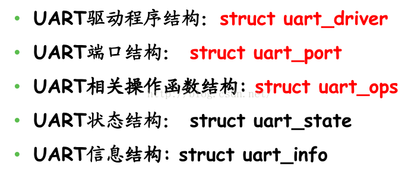
*uart_driver  ------>  uart_state  ------>  uart_port  ------>  uart_ops*
```c
struct uart_driver {
	struct module		*owner;
	const char		*driver_name;
	const char		*dev_name;
	int			 major;
	int			 minor;
	int			 nr;
	struct console		*cons;

	/*
	 * these are private; the low level driver should not
	 * touch these; they should be initialised to NULL
	 */
	struct uart_state	*state;
	struct tty_driver	*tty_driver;
};
```

```c
struct uart_state {
	struct tty_port		port;

	enum uart_pm_state	pm_state;
	struct circ_buf		xmit;

	atomic_t		refcount;
	wait_queue_head_t	remove_wait;
	struct uart_port	*uart_port;
};
```


```c
struct uart_port {
	spinlock_t		lock;			/* port lock */
	unsigned long		iobase;			/* in/out[bwl] */
	unsigned char __iomem	*membase;		/* read/write[bwl] */
	unsigned int		(*serial_in)(struct uart_port *, int);
	void			(*serial_out)(struct uart_port *, int, int);
	void			(*set_termios)(struct uart_port *,
				               struct ktermios *new,
				               struct ktermios *old);
	unsigned int		(*get_mctrl)(struct uart_port *);
	void			(*set_mctrl)(struct uart_port *, unsigned int);
	int			(*startup)(struct uart_port *port);
	void			(*shutdown)(struct uart_port *port);
	void			(*throttle)(struct uart_port *port);
	void			(*unthrottle)(struct uart_port *port);
	int			(*handle_irq)(struct uart_port *);
	void			(*pm)(struct uart_port *, unsigned int state,
				      unsigned int old);
	void			(*handle_break)(struct uart_port *);
	int			(*rs485_config)(struct uart_port *,
						struct serial_rs485 *rs485);
	unsigned int		irq;			/* irq number */
	unsigned long		irqflags;		/* irq flags  */
	unsigned int		uartclk;		/* base uart clock */
	unsigned int		fifosize;		/* tx fifo size */
	unsigned char		x_char;			/* xon/xoff char */
	unsigned char		regshift;		/* reg offset shift */
	unsigned char		iotype;			/* io access style */
	unsigned char		unused1;
}

```
```c
struct uart_ops {
	unsigned int	(*tx_empty)(struct uart_port *);
	void		(*set_mctrl)(struct uart_port *, unsigned int mctrl);
	unsigned int	(*get_mctrl)(struct uart_port *);
	void		(*stop_tx)(struct uart_port *);
	void		(*start_tx)(struct uart_port *);
	void		(*throttle)(struct uart_port *);
	void		(*unthrottle)(struct uart_port *);
	void		(*send_xchar)(struct uart_port *, char ch);
	void		(*stop_rx)(struct uart_port *);
	void		(*enable_ms)(struct uart_port *);
	void		(*break_ctl)(struct uart_port *, int ctl);
	int		(*startup)(struct uart_port *);
	void		(*shutdown)(struct uart_port *);
	void		(*flush_buffer)(struct uart_port *);
	void		(*set_termios)(struct uart_port *, struct ktermios *new,
				       struct ktermios *old);
	void		(*set_ldisc)(struct uart_port *, struct ktermios *);
	void		(*pm)(struct uart_port *, unsigned int state,
			      unsigned int oldstate);

	/*
	 * Return a string describing the type of the port
	 */
	const char	*(*type)(struct uart_port *);

	/*
	 * Release IO and memory resources used by the port.
	 * This includes iounmap if necessary.
	 */
	void		(*release_port)(struct uart_port *);

	/*
	 * Request IO and memory resources used by the port.
	 * This includes iomapping the port if necessary.
	 */
	int		(*request_port)(struct uart_port *);
	void		(*config_port)(struct uart_port *, int);
	int		(*verify_port)(struct uart_port *, struct serial_struct *);
	int		(*ioctl)(struct uart_port *, unsigned int, unsigned long);
#ifdef CONFIG_CONSOLE_POLL
	int		(*poll_init)(struct uart_port *);
	void		(*poll_put_char)(struct uart_port *, unsigned char);
	int		(*poll_get_char)(struct uart_port *);
#endif
};
```


struct
## uart初始化流程
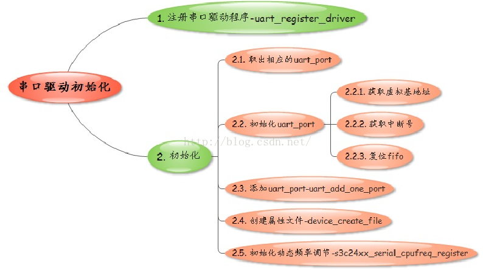

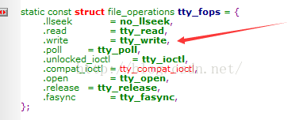

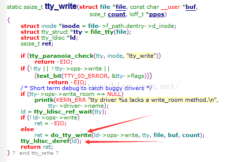
do_tty_write(ld->ops->write)
struct tty_ldisc*ld

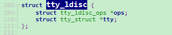

struct tty_ldisc_ops *ops
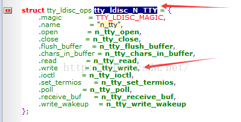


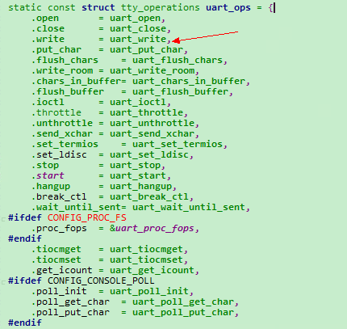
uart重要数据结构调用关系
uart_driver  ------>  uart_state  ------>  uart_port  ------>  uart_ops


## uart打开接收和发送
### uart打开
open ---> tty_open(tty_ops里面的) ---> uart_open(uart_ops里面的) ---> uart_start  --->   上图中红色箭头所指部分（这个就是相当于驱动层里面的open）

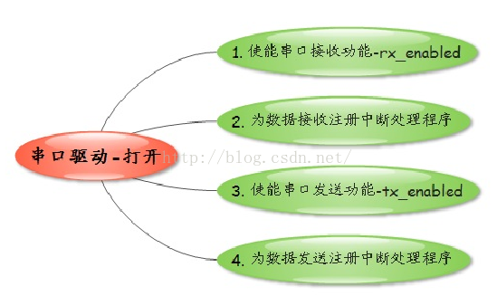

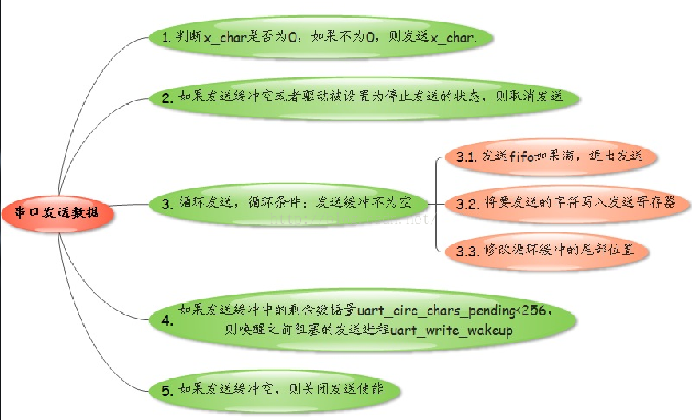

### uart发送
write---> tty_write ---> n_tty_write(线路规程里面) ---> uart_write ---> uart_start ---> 向上看第四张图，也就是驱动层对应的write操作

s3c24xx_serial_start_tx
 ->enable_irq(ourport->tx_irq)
这个enable_irq 会激活serial_startup里面发送和接收处理函数
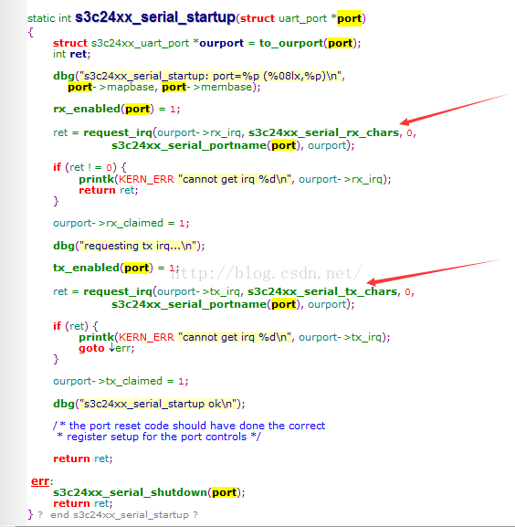

中断处理函数
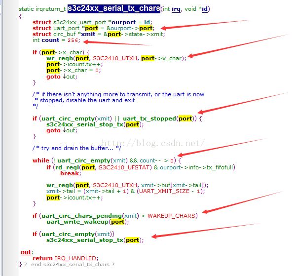


### uart读取
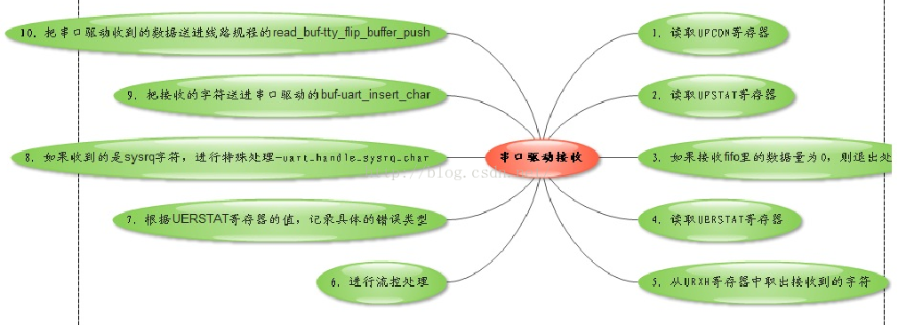
**1. tty子系统是如何响应用户的读数据请求？
2. 串口驱动又是如何来接收处理的？**
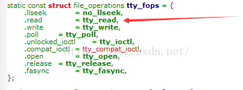
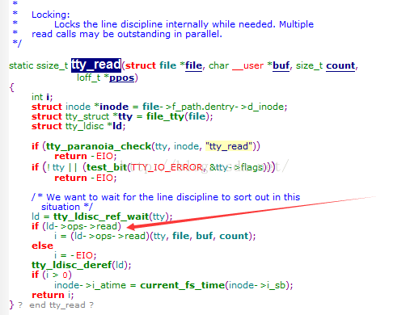
红色箭头部分可以看到这一行其实是调用了线路规程里面的read，ops的数据类型
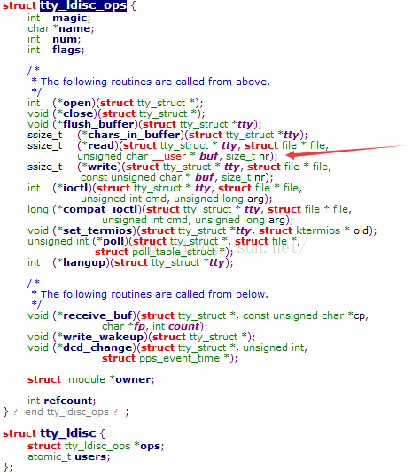

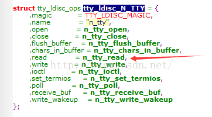
n_tty_read
箭头所指部分是设置应用程序这个进程为阻塞状态！（这行代码还不会立即阻塞）
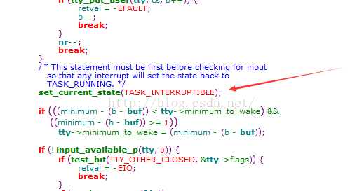
然后箭头下面的第二个if语句里面有个判断，input_available_p判断是否有数据读！
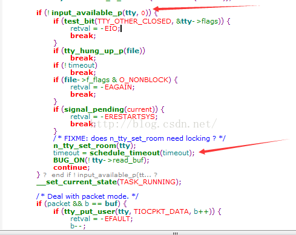

当没有数据可读的时候，将会阻塞，不会被CPU调度占用CPU。结合上面的就是如果没数据就让其阻塞生效如果有数据将会从read_buf中读走数据
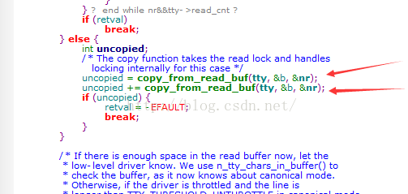
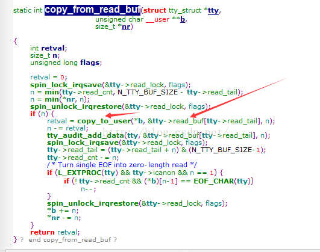
其实这个read_buf和驱动是紧密相关的，当驱动里面有数据的时候，驱动就将数据往read_buf里面送！下面再来看驱动是怎么收到数据的！
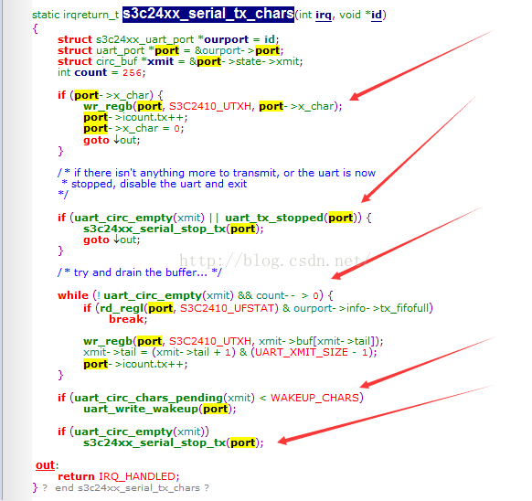
```c
<span style="font-size:18px;">static irqreturn_t s3c24xx_serial_tx_chars(int irq, void *id)
{
	struct s3c24xx_uart_port *ourport = id;
	struct uart_port *port = &ourport->port;
	struct circ_buf *xmit = &port->state->xmit;//循环缓冲
	int count = 256;
	
	//1. 判断x_char是否为0，如果不为0，则发送x_char
	if(port->x_char)
	{
		wr_regb(port, S3C2410_UTXH,  port->x_char);//发送一个字符实际上就是将数据写到UTXH寄存器里面
		goto out;
	}
	
	//2. 判断发送缓冲是否为空或者驱动被设置为停止发送的状态 则取消发送
	if( (uart_circ_empty(xmit)) || (uart_tx_stopped(port)) )
	{
		s3c24xx_serial_stop_tx(port);
		goto out;
	}
	
	//3. 循环发送，循环条件：发送缓冲不为空
	while( (!uart_circ_empty(xmit)) || (count--) > 0 )
	{
		//3.1 发送fifo如果满，退出发送
		if( rd_regl(port, S3C2410_UFSTAT) & (1 << 14) )//这里要查datasheet UFSTAT寄存器14位
			break;
				
		//3.2 将要发送的字符写入发送寄存器
		wr_regb(port, S3C2410_UTXH, xmit->buf[xmit->tail]);//从尾巴里面取出数据
		xmit->tail = (xmit->tail + 1) & (UART_XMIT_SIZE - 1);//循环，如果到最后一位又从第一位开始发送
		
		//3.3 修改循环缓冲的尾部位置
		port->icount.tx++;//更新发送的统计量
	}
	
	//4. 如果发送缓冲中的剩余数据量uart_circ_chars_pending<256
	//则唤醒之前阻塞的发送进程uart_write_wakeup
	if (uart_circ_chars_pending(xmit) < 256)
		uart_write_wakeup(port);
 
	
	//5. 如果发送缓冲为空，则关闭发送使能
	if (uart_circ_empty(xmit))
		s3c24xx_serial_stop_tx(port);
		
out:
	
	return IRQ_HANDLED;//函数出口，表示中断已经处理
}</span>
```


